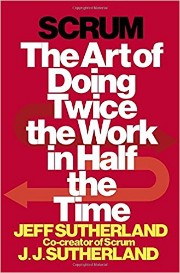
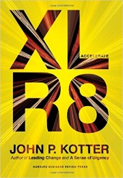
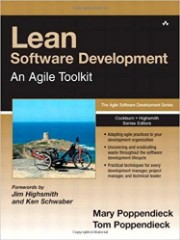
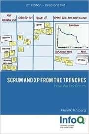

# Contents

- [Useful Links](http://share.xmarks.com/folder/bookmarks/nXDD4nxccp)
- [Books](#books)
- [Gene Kim's Email](#gene-kims-email)

# Books

|  |  |  |
|:---:|:---:|:---:|
|    [The Phoenix Project](http://shop.oreilly.com/product/9780988262508.do)  Gene Kim, Kevin Behr, George Spafford |    [The DevOps Handbook](http://shop.oreilly.com/product/9781942788003.do)  Gene Kim, Jez Humble, Patrick Debois, John Willis   [Read Sample](http://images.itrevolution.com/documents/The_Phoenix_Project_excerpt.pdf) |    [Team of Teams: New Rules of Engagement for a Complex World](https://www.amazon.com/Team-Teams-Rules-Engagement-Complex/dp/1591847486)  General Stanley McChrystal |
|   [The Goal: A Process of Ongoing Improvement](https://www.amazon.com/Goal-Process-Ongoing-Improvement/dp/0884271951) Eliyahu M. Goldratt |    [Scrum: The Art of Doing Twice the Work in Half the Time](https://www.amazon.com/Scrum-Doing-Twice-Work-Half/dp/038534645X) Jeff Sutherland |    [Kanban: Successful Evolutionary Change for Your Technology Business](https://www.amazon.com/Kanban-Successful-Evolutionary-Technology-Business/dp/0984521402) David J. Anderson |
|    [Accelerate: Building Strategic Agility for a Faster-Moving World](https://www.amazon.com/Accelerate-Building-Strategic-Agility-Faster-Moving/dp/1625271743) John P. Kotter |    [Switch: How to Change Things When Change Is Hard](https://www.amazon.com/Switch-Change-Things-When-Hard/dp/0385528752) Chip Heath, Dan Heath |   [Drive: The Surprising Truth About What Motivates Us](https://www.amazon.com/Drive-Surprising-Truth-About-Motivates/dp/1594484805) Daniel H. Pink |
|    [Lean Software Development: An Agile Toolkit](https://www.amazon.com/Lean-Software-Development-Agile-Toolkit/dp/0321150783) Mary Poppendieck, Tom Poppendieck |   [Scrum and Xp from the Trenches](https://www.amazon.com/Scrum-Trenches-2nd-Henrik-Kniberg/dp/1329224272) Henrik Kniberg  [Download](https://www.infoq.com/minibooks/scrum-xp-from-the-trenches-2) |    [The Five Dysfunctions of a Team: A Leadership Fable](https://www.amazon.com/Five-Dysfunctions-Team-Leadership-Fable/dp/0787960756) Patrick Lencioni |
|    [New Product Development Game](https://hbr.org/product/new-new-product-development-game/86116-PDF-ENG) Hirotaka Takeuchi, Ikujiro Nonaka |    [Agile IT Organization Design: For Digital Transformation and Continuous Delivery](https://www.amazon.com/Agile-Organization-Design-Transformation-Continuous/dp/0133903354) Sriram Narayan |    [The Lean Machine: How Harley-Davidson Drove Top-Line Growth and Profitability with Revolutionary Lean Product Development](https://www.amazon.com/Lean-Machine-Harley-Davidson-Profitability-Revolutionary/dp/0814432883) Dantar P. Oosterwal |

# Gene Kim's Email

Here is what you will get if you send an email to [genek@realgenekim.me](mailto:genek@realgenekim.me?subject=devops) (As of Feb 13, 2017)

> Hello all -- 
> 
> It was a privilege to be with you here today! 
> 
> First off, I'm so happy to announce after over 5.5 years of work, The DevOps Handbook is here! Here are some stats on the book: 
> 
> - 23 chapters 
> - 48 case studies 
> - 98,124 words 
> - 48 images 
> - 503 endnotes 
> - 192 footnotes 
> 
> To get a free 130 page excerpt of The DevOps Handbook, just click here: 
> 
> http://bit.ly/handbookslide 
> 
> 1 . Here’s a link to a longer version of the presentation I gave: 
> 
> http://www.slideshare.net/realgenekim/why-everyone-needs-devops-now 
> 
> 2 . You can find the videos and slides from the three-day DevOps Enterprise Summit below — we assembled leaders of large, complex organization who are adopting DevOps are sharing their transformation stories. 
> 
> They showed that DevOps is for horses, and not just for unicorns. Speakers included leaders from GE Energy, Macy’s, Disney, Blackboard, Ticketmaster/LiveNation, Barclays Capital, US Department of Homeland Security, > UK.gov, Nordstrom, Capital One, Raytheon and more… 
> 
> Videos: https://www.youtube.com/channel/UCkyYEVVmT9vQ4yPBR4ciFUA 
> Slides: http://www.slideshare.net/ITRevolution/presentations 
> 
> 3 . To download the free 140 page excerpt of "The Phoenix Project," just put your email address into this form: 
> 
> http://itrevolution.com/wp-content/uploads/files/PhoenixProjectExcerpt.pdf 
> 
> 4 . You can get hours of free samples of "The Phoenix Project" audiobook here: 
> 
> https://soundcloud.com/itrevolution 
> 
> 5 . Here is a link to the DevOps Audit Defense Toolkit: 
> 
> http://bit.ly/DevOpsAudit 
> 
> 6 . If you you'd like to get announcements of early drafts of the upcoming "DevOps Handbook,” as well as other great information, just accept the Mailchimp subscription request -- you'll be getting an announcement in a couple of weeks your inbox. 
> 
> We are now taking pre-orders for the DevOps Handbook at: 
> http://itrevolution.com/devops-handbook 
> 
> Thank you in advance for all your feedback! 
> 
> Cheers! 
> Gene 
>
> \--- 
> Now available in paperback: "The Phoenix Project: A Novel About IT, DevOps, and Helping Your Business Win" 
> http://itrevolution.com/books/phoenix-project-devops-novel/ 
> http://www.realgenekim.me, v: +1-707-847-6771 (707-VIS-OPS1), @realgenekim 

