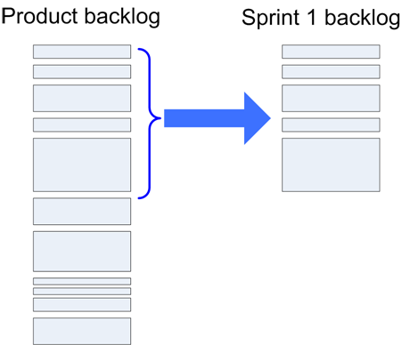
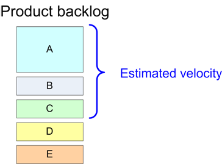
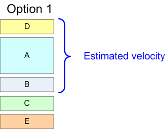
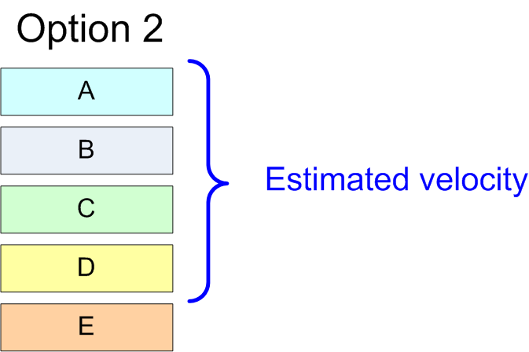
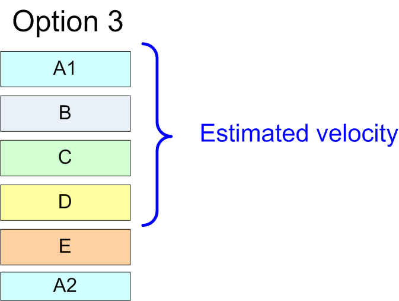
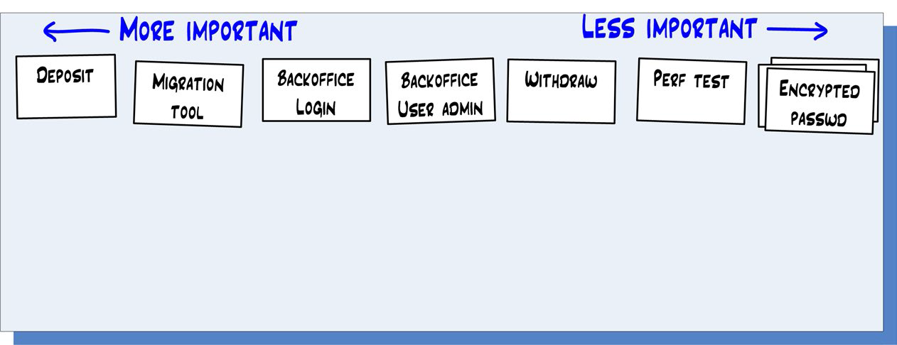
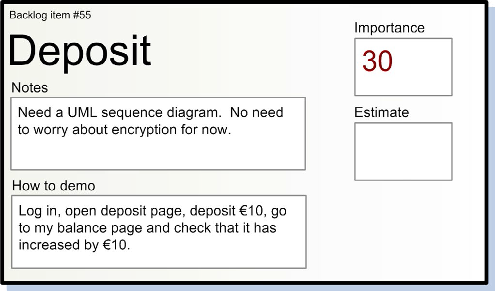
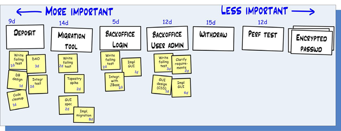
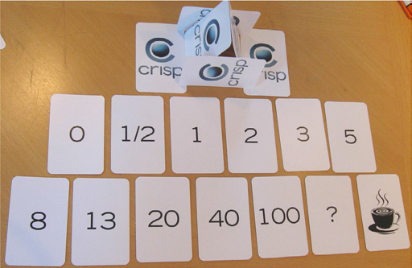
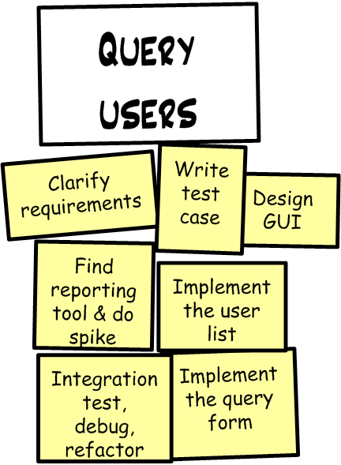

# Forward

## Nokia Requirements for Iterative Development

- Iterations must have fixed time boxes and be less than six weeks long.
- A Scrum team must have a product owner and know who that person is.
- The product owner must have a product backlog with estimates created by the team.
- The team must have a burn-down chart and know their velocity.
- There must be no one outside a team interfering with the team during a sprint.

# Part One - Intro

- Scrum is not a methodology, it is a *framework*. This means Scrum is not really going to tell you exactly what to do.
- This document does not cluiam to represent "the right way" to do Scrum! It only represents one way to do Scrum.
- What is Scrum?
  - http://agilemanifesto.org
  - http://www.mountaingoatsoftware.com/scrum
  - ~~http://www.xpprogramming.com/xpmag/whatisxp.html~~ ([Web archive](http://web.archive.org/web/20081204043819/http://www.xprogramming.com/xpmag/whatisxp.htm))
  - http://www.scrumguides.org
  
# Part Two - How we do product backlogs
  
- A good product starts with a customer need and a vision. The product backlog is the result of refining that vision into concrete deliverables. 
- The product backlog is basically a prioritized list of requirements, or stories, or features, or whatevers, described using the customer’s terminology. 
  - **ID**: for reference
  - **Name**: short (2-10 words) and descriptive
  - **Initial estimate**: unit in story point 
    - The important thing is not to get the absolute estimates correct, the important thing is to get the relative estimates correct
    - Estimates are in story points or T-shirt sizes (S/M/L), or there are even no estimates at all. 
  - **How to demo**: This is essentially a simple test spec.
    - If you practice TDD (test-driven development), this description can be used as pseudo-code for your acceptance-test code.
  - **Notes**: other info, clarification etc.
- Backlog management tools available (Trello and LeanKit and Jira are popular) or a Google Spreadsheet (very practical!).

**Product Backlog Example**

| ID | Name | Estimate | How to demo | Notes |
| --- | --- | --- | --- | --- | --- |
| 1 | Deposit | 5 | Log in, open deposit page, deposit €10, go to my balance page and check that it has increased by €10 | Need a UML sequence diagram. No need to worry about encryption for now. |
| 2 | See your own transaction history | 8 | Log in, click on “transactions”. Do a deposit. Go back to transactions, check that the new deposit shows up. | Use paging to avoid large DB queries. Design similar to view users page. |

## How we keep the product backlog at a business level

- The team is normally better suited to figure out *how* to solve something, so the product owner should focus on business goals.
- There’s an old and well-established template for this: “As X, I want Y, so that Z.” For example “As buyer, I want to save my shopping cart, so that I can continue shopping tomorrow.”

# Part Three - How we prepare for sprint planning

- Make sure the product backlog is in shipshape before the sprint planning meeting. You know the saying “shit in = shit out”?
- There should be one product backlog and one product owner (per product that is)
- Sort the list according to their importance priorities.
- The product owner should understand each story why it is there.
- People other than the product owner may add stories to the product backlog. But they may not assign an importance level – that is the product owner’s sole right. 
- They may not add time estimates either, that is the team’s sole right.

# Part Four - How we do sprint planning

- Retrospectives are the most important event! Because well-functioning retrospectives will help fix other things that are broken. 
- The purpose of the sprint planning meeting is to give the team enough information to be able to work in undisturbed peace for a few weeks, and to give the product owner enough confidence to let them do so.
- The concrete output of the sprint planning meeting is:
  - A sprint goal
  - A list of team members (and their commitment levels, if not 100%)
  - A sprint backlog (= a list of stories included in the sprint)
  - A defined sprint demo date
  - A defined time and place for the daily scrum

## Why the product owner has to attend

- Scope and importance are set by the product owner. Estimate is set by the team.
- As they do this, they will come up with important scope questions – “Does this ‘delete user’ story include going through each pending transaction for that user and canceling it?” 
- What if the product owner still insists that he doesn’t have time to join sprint planning meetings? 
  - Try to get someone in the team to volunteer as product-owner proxy during the meeting and tell the product owner.
-  I strongly recommend separating backlog refinement (estimation, story splitting, etc.) into a separate meeting so that sprint planning can be more focused. Product owner participation is still crucial though, in both meetings.

## Why quality is not negotiable

- I try to distinguish between *internal quality* and *external quality*:
  - *External quality* is what is perceived by the users of the system. e.g. UI/UX
  - *Internal quality* refers to issues that usually aren’t visible to the user. e.g. system design consistency, test coverage, code readability, refactoring, etc.
- I treat external quality as part of scope. In some case, you release a version of the system that has a clumsy and slow user interface, and then release a cleaned-up version later.
- ~~Internal quality, however, is not up for discussion. It is the team’s responsibility to maintain the system’s quality under all circumstances and this is simply not negotiable.~~
- ~~My experience is that sacrificing internal quality is almost always a terrible, terrible idea.~~
- Sometimes it makes perfect business sense to sacrifice quality in the short term and to commit to letting the team pay back the technical debt in the near future (sometimes the team will add a “clean up” story to the product backlog, as a reminder). 
-  High internal quality should be the norm, and exceptions should be treated as exceptional.

## Sprint planning meetings that drag on and on...

- I’ve seen meet weekly for one hour for backlog refinement, so that sprint planning can be focused on, well, sprint planning.
- a sprint planning meeting should normally not take more than one hour per week of sprint length (considerably less for experienced teams), so three hours or less for a three-week sprint.
- Letting the meeting drag on. That usually doesn’t accomplish anything, because people are tired. 
- The next option is actually quite OK: to schedule a new meeting next day. Except that people usually are impatient and want to get going with the sprint.
- Cut it short. And yes, the sprint suffers. The upside, however, is that the team has learned a very valuable lesson, and the next sprint planning meeting will be much more efficient.
- Decide up front how much time you are willing to invest, and then stick to it! 

> Scrum is like any other tool – you can use a hammer to build something or to smash your thumb. Either way, don’t blame the tool.

## Sprint-planning-meeting agenda

**Backlog Refinement**

| | |
| --- | --- |
| **10:30-11:30** | Team time-estimates, and breaks down items as necessary. Product owner updates importance ratings as necessary. Items are clarified. “How to demo” is filled in for all high-importance items. |

**Sprint Planning**

| | |
| --- | --- |
| **13:30-14:00** | Product owner goes through sprint goal and summarizes product backlog. Demo place, date, and time is set. | 
| **14:00-15:00** | Team selects stories to be included in sprint. Do velocity calculations as a reality check. |
| **15:00-16:00** | Select time and place for daily scrum (if different from last sprint). Further breakdown of stories into tasks. |

- 10-minute break each hour
- Most backlog refinement should be done *before* sprint planning.

## Defining the sprint length

| Short sprint | Long sprint |
| --- | --- |
| short feedback cycle   more frequent deliveries   more frequent customer feedback   less time spent running in the wrong direction   learn and improve faster | The team gets more time to build up momentum   they get more room to recover from problems and still make the sprint goal   you get less overhead in terms of sprint planning meetings, demos, etc. |
| Product owners like | Devlopers like |
 
- *do* experiment with sprint lengths initially. Don’t waste too much time *analyzing*, just select a decent length and give it a shot for a sprint or two, then change length.
- Most Scrum teams I meet (almost all, in fact) end up doing two-week or three-week sprints.
 
## Defining the sprint goal
 
- It is hard to come up with a sprint goal. But I have found that it really pays to squeeze one out. Better a half-crappy goal than none at all.
- The important thing is that it should be in business terms, not technical terms. This means in terms that people outside the team can understand.
- The sprint goal may seem rather silly and contrived during the sprint planning, but it often comes to use in mid-sprint, when people are starting to get confused about what they should be doing.
- But I find that it’s not important to have a goal at a sprint level; it can be just as fine to have a higher-level goal that covers several sprints, or the next release cycle.

## Deciding which stories to include in the sprint

- The team decides how many stories to include in the sprint. Not the product owner or anybody else.

This raises two questions:

### 1. How can product owner affect which stories make it to the sprint?

| | |
| --- | --- |
|  | The product owner is disappointed that story D won’t be included in the sprint. What are his options during the sprint planning meeting? |
|  | Add D and remove C. |
|  | Reduce the scope of A. |
|  | Split the scope of A. |

- The product owner normally can’t control the estimated velocity, there are many ways in which he can influence which stories make it into the sprint.

### 2. How does the team decide which stories to include in the sprint?

#### 1) Gut Feel

- Gut feel works pretty well for small teams and short sprints.

#### 2) Velocity calculations

- This technique involves two steps:
  - 1) Decide estimated velocity.
  - 2) Calculate how many stories you can add without exceeding estimated velocity.
- Velocity is a measurement of “amount of work done”, where each item is weighted in terms of its initial estimate.

- Note that the actual velocity is based on the initial estimates of each story. Any updates to the story time estimates done during the sprint are ignored.
- It is a crude number. But it is still a useful number, especially when compared to nothing at all.
- The value of stuff half-done is zero (may in fact be negative).
- One very simple way to estimate velocity is to look at the team’s history. What was their velocity during the past few sprints? 
- This technique is known as *yesterday’s weather*.
- It is only feasible for teams that have done a few sprints already (so statistics are available) and will do the next sprint in pretty much the same way, with the same team size and same working conditions etc. This is of course not always the case.

## Which estimating technique do we use?

- If we add a new person to the team, the velocity will usually go down the first sprint or two, since people spend time onboarding the new person. If a team gets too big (like 10+ people), velocity definitely goes down. 
- Just look at how much you got done the last few sprints, by counting story points, or even just counting the number of stories if you don’t have estimates at all.
- The less historical data you have, the more you need to rely on gut feel.
- Once we have a preliminary list, I do a “gut feeling” check. I ask the team to ignore the numbers for a moment and just think about if this *feels* like a realistic chunk to bite off for a sprint. If it feels like too much, we remove a story or two. And vice versa.

## Why we use index cards

- A solution that works much better is to create index cards and put them up on the wall (or a large table).

- This is a superior user interface compared to computer and projector, because:
  - People stand up and walk around => they stay awake and alert longer.
  - Everybody feels more personally involved (rather than just the guy with the keyboard).
  - Multiple stories can be edited simultaneously.
  - Reprioritizing is trivial – just move the index cards around.
  - After the meeting, the index cards can be carried right off to the team room and be used as a wall-based task board.
- Experiment with different tools and find what works best in your context. 

> Just make sure you are adapting the tool to your process, and not vice versa.

- After the sprint planning meeting, our Scrum master manually updates the Excel-based product backlog with respect to any changes that were made to the physical story index cards.
- Time estimates are usually easier to do (and more accurate) if a story is broken down into tasks/activities.
- Physically, we do this by adding little Post-it notes under each story, each Post-it reflecting one task within that story.

- We don’t update the Excel-based product backlog with respect to our task breakdowns, for two reasons:
  - They are frequently changed and refined during the sprint.
  - The product owner doesn’t need to be involved at this level of detail anyway.
  
## Definition of “done”

- It is important that the product owner and the team agree on a clear definition of “done”.
- Whenever possible, we use the done definition “ready to deploy to production” but sometimes we have to make do with the done definition “deployed on test server and ready for acceptance test”.
- A concrete checklist is more useful – just make sure it isn’t too long. Treat it as a default, not Holy Scripture.
  - Focus on the things that people tend to forget (like “update the release notes” or “no added technical debt”
- If you often run into confusion about the definition of done (which we did in the beginning) you should probably have a “definition of done” field on each individual story.

## Time estimating using planning poker

- Estimating is a team activity – every team member is usually involved.
- By asking everybody to estimate each item, we make sure that each team member understands what each item is about. 
  - This increases the likelihood that team members will help each other out during the sprint. 
  - This also increases the likelihood that important questions about the story come up early.
- If you ask the team to provide an estimate, normally the person who understands the story best will be the first one to blurt one out. Unfortunately, this will strongly affect everybody else’s estimates.
- There is an excellent technique to avoid this – it is called planning poker.

- Each team member gets a deck of 13 cards as shown above.
- Whenever a story is to be estimated, each team member selects a card and places it face down on the table. 
- When all team members are done, the cards on the table are revealed simultaneously. 
- If there is a large discrepancy between two estimates, the team discusses the differences. They might do some kind of task breakdown.
- Afterwards, the team estimates again. This loop is repeated until the time estimates converge

- It is important to remind team members that they are to estimate the total amount of work involved in the story. Not just their part of the work.
- If a story is estimated at approximately 20 story points, it is not relevant to discuss whether it should be 20 or 18 or 21. All we know is that it is a large story and that it is hard to estimate.
- Want more detailed estimates? Split the story into smaller stories and estimate the smaller stories instead!

- Some special cards to note:
  - **0** = “This story is already done,” or “this story is pretty much nothing, just a few minutes of work’”
  - **?** = “I have absolutely no idea at all. None.”
  - **Coffee cup** = “I’m too tired to think. Let’s take a short break.”
  
## Clarifying stories

- How do you ensure that the product owner’s understanding of a story matches the team’s understanding? Or that each team member has the same understanding of each story?
  - The simplest technique is simply to make sure that all the fields are filled in for each story. Some call this “definition of ready”.
- So “definition of done” is a checklist for when a story is done, and “definition of ready” is a checklist for when a story is ready to be pulled into a sprint. Very useful.
- The “how to demo” description of a story can (and should) be very brief! Otherwise, you won’t finish the sprint planning meeting on time.
- It is basically a high-level plain-English description of how to execute the most typical test scenario manually. “Do this, then that, then verify this.”.
- I have found that this simple description often uncovers important misunderstandings about the scope of a story. Good to discover them early, right?
- Think of the story as a high-level problem statement, and the “definition of done” as a concrete example of how it might look like when done.

## Breaking down stories into smaller stories

- Stories shouldn’t be too small or too big (in terms of estimates).
  - too small --> micromanagement
  - too big --> risk of partially complete, risk to choose between under-committing and overcommitting.
- Break a large story into smaller stories. Just make sure that the smaller stories still represent deliverables with business value.
- Five to 15 stories in a sprint is useful guideline. Fewer than five usually means the stories are too big for the size of the sprint, while more than 15 usually means the team has pulled in too much and won’t finish everything.

## Breaking down stories into tasks

- Stories are deliverable stuff that the product owner cares about. Tasks are non-deliverable stuff, or stuff that the product owner doesn’t care about.

| | |
| --- | --- |
| Example of breaking down a story into smaller stories: | Example of breaking down a story into tasks: |
|  |  |

- Here are some interesting observations:
  - New Scrum teams are reluctant to spending time breaking down
  - For clearly understood stories, it is just as easy to do this breakdown up front as it is to do later.
  - This type of breakdown often reveals additional work that causes the time estimate to go up.
  - This type of breakdown up front makes daily scrum meetings noticeably more efficient.
- Task breakdown is a great opportunity to identify dependencies and figure out ways to deal with those dependencies.
- The earlier you discover a dependency, the less likely it is to blow up your sprint!

## Defining time and place for the daily scrum

- Without this, your sprint will be off to a bad start.
- Most teams prefer mornings though.
- **Disadvantage of afternoon scrums**: Whe n you come to work in the morning, you have to try to remember what you told people yesterday about what you will be doing today.
- **Disadvantage of morning scrums**: When you come to work in the morning, you have to try to remember what you did yesterday so that you can report this.
- My opinion is the first disadvantage is worse, the most important thing is what you are *going to do*, not what you *did*.

## Where to draw the line

- **Priority 1**: A sprint goal and demo date. This is the very least you need to start a sprint.
  - To be honest, though, I have never actually started a sprint with this little info.
- **Priority 2**: List of which stories the team has accepted for this sprint.
- **Priority 3**: “Estimate” filled in for each story in sprint.
- **Priority 4**: “How to demo” filled in for each story in sprint.
- **Priority 5**: Velocity and resource calculations.
  - Keep it simple and high-level, to take at most five minutes. Ask: “From a staffing perspective, is there anything majorly different about this sprint than past sprints?” If not, use yesterday’s weather. If so, make adjustments accordingly.
- **Priority 6**: Specified time and place for daily scrum.
- **Priority 7**: Stories broken down into tasks.

## Tech stories

- Or non-functional items, not of direct value to the product owner.
- For examples: Install continuous-build server, Write a system design overview, Refactor the DAO layer, Upgrade Jira.
- So here’s what we do:
  - Look hard for a way to transform a tech story into a normal story with measurable business value.
  - See if the work could be done as a task within another story.
  - If both of the above fail, define it as a tech story, and keep a separate list of such stories. Let the product owner see it but not edit it.
- Smaller tech stories are just embedded into the day-to-day work, while larger stories are written down and placed in a tech backlog.
- The team and product owner agree on a guideline such as “10-20% of our time is spent on tech stories”.
- Ask at the retro, “Roughly how much of our sprint capacity did we spend on tech stories, and did that feel about right?”

> Transparency is one of the core values of Scrum

- If you can’t have frank conversations with the product owner about things like tech stories, quality, and technical debt, then you have a deeper problem that really needs to be addressed!
- You don’t have to involve the product owner in every conversation

> The relationship should really be based on trust and respect; without that, you are unlikely to succeed with whatever you are building.

## Bug tracking system (Jira) vs. product backlog

- We’ve tried several strategies:
  1. Product owner prints out the most high priority Jira items, brings them to the sprint planning meeting, and puts them up on the wall.
  2. Product owner creates stories that refer to Jira items.
  3. Fixing is considered to be outside of the sprint. It is then simply assumed that the team will spend a certain amount of time each sprint fixing Jira-reported bugs.
  4. Put the product backlog in Jira (i.e. ditch Excel). Treat bugs just like any other story.
- There’s no single best practice; each strategy above can be fine depending on the context. Experiment until you find what works best for you.

## Sprint planning meeting is finally over!

- Spend a lot of effort getting that right, and the rest will be so much easier. Or vice versa – get the other stuff right and sprint planning is a piece of cake. :o)
- The sprint planning meeting is successful if everyone exit the meeting with a smile, and wake up the next morning with a smile, and do their first daily scrum with a smile.
- All kinds of things can go horribly wrong down the line, but at least you can’t blame the sprint plan, :o)