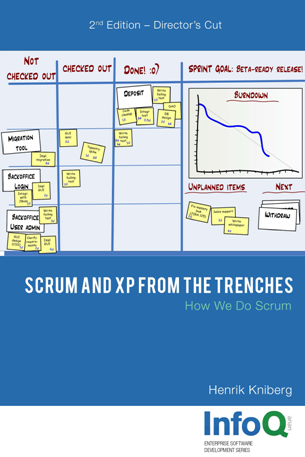  
**Scrum and XP from the Trenches - 2nd Edition***  
Henrik Kniberg

The book can be downloaded for free from [here](https://www.infoq.com/minibooks/scrum-xp-from-the-trenches-2).

# Table of Content

- [Part One - Intro](#Part-One---Intro)
- [Part Two - How we do product backlogs](#Part-Two---How-we-do-product-backlogs)
- [Part Three - How we prepare for sprint planning](#Part-Three---How-we-prepare-for-sprint-planning)
- [Part Four - How we do sprint planning](#Part-Four---How-we-do-sprint-planning)
- [Part Five - How we communicate sprints](#Part-Five---How-we-communicate-sprints)
- [Part Six - How we do sprint backlogs](#Part-Six---How-we-do-sprint-backlogs)
- [Part Seven - How we arrange the team room](#Part-Seven---How-we-arrange-the-team-room)
- [Part Eight - How we do daily scrums](#Part-Eight---How-we-do-daily-scrums)
- [Part Nine - How we do ~~sprint demos~~ sprint review](#Part-Nine---How-we-do-sprint-demos-sprint-review)
- [Part Ten - How we do sprint retrospectives](#Part-Ten---How-we-do-sprint-retrospectives)
- [Part Eleven - Slack time between sprints](#Part-Eleven---Slack-time-between-sprints)
- [Part Twelve - How we do release planning and fixed-price contracts](#Part-Twelve---How-we-do-release-planning-and-fixed-price-contracts)
- [Part Thirteen - How we combine Scrum with XP](#Part-Thirteen---How-we-combine-Scrum-with-XP)
- [Part Fourteen - How we do testing](#Part-Fourteen---How-we-do-testing)

# Forward

## Nokia Requirements for Iterative Development

- Iterations must have fixed time boxes and be less than six weeks long.
- A Scrum team must have a product owner and know who that person is.
- The product owner must have a product backlog with estimates created by the team.
- The team must have a burn-down chart and know their velocity.
- There must be no one outside a team interfering with the team during a sprint.

# Part One - Intro

- Scrum is not a methodology, it is a *framework*. This means Scrum is not really going to tell you exactly what to do.
- This document does not cluiam to represent "the right way" to do Scrum! It only represents one way to do Scrum.
- What is Scrum?
  - [http://agilemanifesto.org](http://agilemanifesto.org)
  - [http://www.mountaingoatsoftware.com/scrum](http://www.mountaingoatsoftware.com/scrum)
  - ~~http://www.xpprogramming.com/xpmag/whatisxp.html~~ ([Web archive](http://web.archive.org/web/20081204043819/http://www.xprogramming.com/xpmag/whatisxp.htm))
  - [http://www.scrumguides.org](http://www.scrumguides.org)
  
# Part Two - How we do product backlogs
  
- A good product starts with a customer need and a vision. The product backlog is the result of refining that vision into concrete deliverables. 
- The product backlog is basically a prioritized list of requirements, or stories, or features, or whatevers, described using the customer’s terminology. 
  - **ID**: for reference
  - **Name**: short (2-10 words) and descriptive
  - **Initial estimate**: unit in story point 
    - The important thing is not to get the absolute estimates correct, the important thing is to get the relative estimates correct
    - Estimates are in story points or T-shirt sizes (S/M/L), or there are even no estimates at all. 
  - **How to demo**: This is essentially a simple test spec.
    - If you practice TDD (test-driven development), this description can be used as pseudo-code for your acceptance-test code.
  - **Notes**: other info, clarification etc.
- Backlog management tools available (Trello and LeanKit and Jira are popular) or a Google Spreadsheet (very practical!).

**Product Backlog Example**

| ID | Name | Estimate | How to demo | Notes |
| --- | --- | --- | --- | --- | --- |
| 1 | Deposit | 5 | Log in, open deposit page, deposit €10, go to my balance page and check that it has increased by €10 | Need a UML sequence diagram. No need to worry about encryption for now. |
| 2 | See your own transaction history | 8 | Log in, click on “transactions”. Do a deposit. Go back to transactions, check that the new deposit shows up. | Use paging to avoid large DB queries. Design similar to view users page. |

## How we keep the product backlog at a business level

- The team is normally better suited to figure out *how* to solve something, so the product owner should focus on business goals.
- There’s an old and well-established template for this: “As X, I want Y, so that Z.” For example “As buyer, I want to save my shopping cart, so that I can continue shopping tomorrow.”

# Part Three - How we prepare for sprint planning

- Make sure the product backlog is in shipshape before the sprint planning meeting. You know the saying “shit in = shit out”?
- There should be one product backlog and one product owner (per product that is)
- Sort the list according to their importance priorities.
- The product owner should understand each story why it is there.
- People other than the product owner may add stories to the product backlog. But they may not assign an importance level – that is the product owner’s sole right. 
- They may not add time estimates either, that is the team’s sole right.

# Part Four - How we do sprint planning

- Retrospectives are the most important event! Because well-functioning retrospectives will help fix other things that are broken. 
- The purpose of the sprint planning meeting is to give the team enough information to be able to work in undisturbed peace for a few weeks, and to give the product owner enough confidence to let them do so.
- The concrete output of the sprint planning meeting is:
  - A sprint goal
  - A list of team members (and their commitment levels, if not 100%)
  - A sprint backlog (= a list of stories included in the sprint)
  - A defined sprint demo date
  - A defined time and place for the daily scrum

## Why the product owner has to attend

- Scope and importance are set by the product owner. Estimate is set by the team.
- As they do this, they will come up with important scope questions – “Does this ‘delete user’ story include going through each pending transaction for that user and canceling it?” 
- What if the product owner still insists that he doesn’t have time to join sprint planning meetings? 
  - Try to get someone in the team to volunteer as product-owner proxy during the meeting and tell the product owner.
-  I strongly recommend separating backlog refinement (estimation, story splitting, etc.) into a separate meeting so that sprint planning can be more focused. Product owner participation is still crucial though, in both meetings.

## Why quality is not negotiable

- I try to distinguish between *internal quality* and *external quality*:
  - *External quality* is what is perceived by the users of the system. e.g. UI/UX
  - *Internal quality* refers to issues that usually aren’t visible to the user. e.g. system design consistency, test coverage, code readability, refactoring, etc.
- I treat external quality as part of scope. In some case, you release a version of the system that has a clumsy and slow user interface, and then release a cleaned-up version later.
- ~~Internal quality, however, is not up for discussion. It is the team’s responsibility to maintain the system’s quality under all circumstances and this is simply not negotiable.~~
- ~~My experience is that sacrificing internal quality is almost always a terrible, terrible idea.~~
- Sometimes it makes perfect business sense to sacrifice quality in the short term and to commit to letting the team pay back the technical debt in the near future (sometimes the team will add a “clean up” story to the product backlog, as a reminder). 
-  High internal quality should be the norm, and exceptions should be treated as exceptional.

## Sprint planning meetings that drag on and on...

- I’ve seen meet weekly for one hour for backlog refinement, so that sprint planning can be focused on, well, sprint planning.
- a sprint planning meeting should normally not take more than one hour per week of sprint length (considerably less for experienced teams), so three hours or less for a three-week sprint.
- Letting the meeting drag on. That usually doesn’t accomplish anything, because people are tired. 
- The next option is actually quite OK: to schedule a new meeting next day. Except that people usually are impatient and want to get going with the sprint.
- Cut it short. And yes, the sprint suffers. The upside, however, is that the team has learned a very valuable lesson, and the next sprint planning meeting will be much more efficient.
- Decide up front how much time you are willing to invest, and then stick to it! 

> Scrum is like any other tool – you can use a hammer to build something or to smash your thumb. Either way, don’t blame the tool.

## Sprint-planning-meeting agenda

**Backlog Refinement**

| | |
| --- | --- |
| **10:30-11:30** | Team time-estimates, and breaks down items as necessary. Product owner updates importance ratings as necessary. Items are clarified. “How to demo” is filled in for all high-importance items. |

**Sprint Planning**

| | |
| --- | --- |
| **13:30-14:00** | Product owner goes through sprint goal and summarizes product backlog. Demo place, date, and time is set. | 
| **14:00-15:00** | Team selects stories to be included in sprint. Do velocity calculations as a reality check. |
| **15:00-16:00** | Select time and place for daily scrum (if different from last sprint). Further breakdown of stories into tasks. |

- 10-minute break each hour
- Most backlog refinement should be done *before* sprint planning.

## Defining the sprint length

| Short sprint | Long sprint |
| --- | --- |
| short feedback cycle   more frequent deliveries   more frequent customer feedback   less time spent running in the wrong direction   learn and improve faster | The team gets more time to build up momentum   they get more room to recover from problems and still make the sprint goal   you get less overhead in terms of sprint planning meetings, demos, etc. |
| Product owners like | Devlopers like |
 
- *do* experiment with sprint lengths initially. Don’t waste too much time *analyzing*, just select a decent length and give it a shot for a sprint or two, then change length.
- Most Scrum teams I meet (almost all, in fact) end up doing two-week or three-week sprints.
 
## Defining the sprint goal
 
- It is hard to come up with a sprint goal. But I have found that it really pays to squeeze one out. Better a half-crappy goal than none at all.
- The important thing is that it should be in business terms, not technical terms. This means in terms that people outside the team can understand.
- The sprint goal may seem rather silly and contrived during the sprint planning, but it often comes to use in mid-sprint, when people are starting to get confused about what they should be doing.
- But I find that it’s not important to have a goal at a sprint level; it can be just as fine to have a higher-level goal that covers several sprints, or the next release cycle.

## Deciding which stories to include in the sprint

- The team decides how many stories to include in the sprint. Not the product owner or anybody else.

This raises two questions:

### 1. How can product owner affect which stories make it to the sprint?

| | |
| --- | --- |
|  | The product owner is disappointed that story D won’t be included in the sprint. What are his options during the sprint planning meeting? |
|  | Add D and remove C. |
|  | Reduce the scope of A. |
|  | Split the scope of A. |

- The product owner normally can’t control the estimated velocity, there are many ways in which he can influence which stories make it into the sprint.

### 2. How does the team decide which stories to include in the sprint?

#### 1) Gut Feel

- Gut feel works pretty well for small teams and short sprints.

#### 2) Velocity calculations

- This technique involves two steps:
  - 1) Decide estimated velocity.
  - 2) Calculate how many stories you can add without exceeding estimated velocity.
- Velocity is a measurement of “amount of work done”, where each item is weighted in terms of its initial estimate.

- Note that the actual velocity is based on the initial estimates of each story. Any updates to the story time estimates done during the sprint are ignored.
- It is a crude number. But it is still a useful number, especially when compared to nothing at all.
- The value of stuff half-done is zero (may in fact be negative).
- One very simple way to estimate velocity is to look at the team’s history. What was their velocity during the past few sprints? 
- This technique is known as *yesterday’s weather*.
- It is only feasible for teams that have done a few sprints already (so statistics are available) and will do the next sprint in pretty much the same way, with the same team size and same working conditions etc. This is of course not always the case.

## Which estimating technique do we use?

- If we add a new person to the team, the velocity will usually go down the first sprint or two, since people spend time onboarding the new person. If a team gets too big (like 10+ people), velocity definitely goes down. 
- Just look at how much you got done the last few sprints, by counting story points, or even just counting the number of stories if you don’t have estimates at all.
- The less historical data you have, the more you need to rely on gut feel.
- Once we have a preliminary list, I do a “gut feeling” check. I ask the team to ignore the numbers for a moment and just think about if this *feels* like a realistic chunk to bite off for a sprint. If it feels like too much, we remove a story or two. And vice versa.

## Why we use index cards

- A solution that works much better is to create index cards and put them up on the wall (or a large table).

- This is a superior user interface compared to computer and projector, because:
  - People stand up and walk around => they stay awake and alert longer.
  - Everybody feels more personally involved (rather than just the guy with the keyboard).
  - Multiple stories can be edited simultaneously.
  - Reprioritizing is trivial – just move the index cards around.
  - After the meeting, the index cards can be carried right off to the team room and be used as a wall-based task board.
- Experiment with different tools and find what works best in your context. 

> Just make sure you are adapting the tool to your process, and not vice versa.

- After the sprint planning meeting, our Scrum master manually updates the Excel-based product backlog with respect to any changes that were made to the physical story index cards.
- Time estimates are usually easier to do (and more accurate) if a story is broken down into tasks/activities.
- Physically, we do this by adding little Post-it notes under each story, each Post-it reflecting one task within that story.

- We don’t update the Excel-based product backlog with respect to our task breakdowns, for two reasons:
  - They are frequently changed and refined during the sprint.
  - The product owner doesn’t need to be involved at this level of detail anyway.
  
## Definition of “done”

- It is important that the product owner and the team agree on a clear definition of “done”.
- Whenever possible, we use the done definition “ready to deploy to production” but sometimes we have to make do with the done definition “deployed on test server and ready for acceptance test”.
- A concrete checklist is more useful – just make sure it isn’t too long. Treat it as a default, not Holy Scripture.
  - Focus on the things that people tend to forget (like “update the release notes” or “no added technical debt”
- If you often run into confusion about the definition of done (which we did in the beginning) you should probably have a “definition of done” field on each individual story.

## Time estimating using planning poker

- Estimating is a team activity – every team member is usually involved.
- By asking everybody to estimate each item, we make sure that each team member understands what each item is about. 
  - This increases the likelihood that team members will help each other out during the sprint. 
  - This also increases the likelihood that important questions about the story come up early.
- If you ask the team to provide an estimate, normally the person who understands the story best will be the first one to blurt one out. Unfortunately, this will strongly affect everybody else’s estimates.
- There is an excellent technique to avoid this – it is called planning poker.

- Each team member gets a deck of 13 cards as shown above.
- Whenever a story is to be estimated, each team member selects a card and places it face down on the table. 
- When all team members are done, the cards on the table are revealed simultaneously. 
- If there is a large discrepancy between two estimates, the team discusses the differences. They might do some kind of task breakdown.
- Afterwards, the team estimates again. This loop is repeated until the time estimates converge

- It is important to remind team members that they are to estimate the total amount of work involved in the story. Not just their part of the work.
- If a story is estimated at approximately 20 story points, it is not relevant to discuss whether it should be 20 or 18 or 21. All we know is that it is a large story and that it is hard to estimate.
- Want more detailed estimates? Split the story into smaller stories and estimate the smaller stories instead!

- Some special cards to note:
  - **0** = “This story is already done,” or “this story is pretty much nothing, just a few minutes of work’”
  - **?** = “I have absolutely no idea at all. None.”
  - **Coffee cup** = “I’m too tired to think. Let’s take a short break.”
  
## Clarifying stories

- How do you ensure that the product owner’s understanding of a story matches the team’s understanding? Or that each team member has the same understanding of each story?
  - The simplest technique is simply to make sure that all the fields are filled in for each story. Some call this “definition of ready”.
- So “definition of done” is a checklist for when a story is done, and “definition of ready” is a checklist for when a story is ready to be pulled into a sprint. Very useful.
- The “how to demo” description of a story can (and should) be very brief! Otherwise, you won’t finish the sprint planning meeting on time.
- It is basically a high-level plain-English description of how to execute the most typical test scenario manually. “Do this, then that, then verify this.”.
- I have found that this simple description often uncovers important misunderstandings about the scope of a story. Good to discover them early, right?
- Think of the story as a high-level problem statement, and the “definition of done” as a concrete example of how it might look like when done.

## Breaking down stories into smaller stories

- Stories shouldn’t be too small or too big (in terms of estimates).
  - too small --> micromanagement
  - too big --> risk of partially complete, risk to choose between under-committing and overcommitting.
- Break a large story into smaller stories. Just make sure that the smaller stories still represent deliverables with business value.
- Five to 15 stories in a sprint is useful guideline. Fewer than five usually means the stories are too big for the size of the sprint, while more than 15 usually means the team has pulled in too much and won’t finish everything.

## Breaking down stories into tasks

- Stories are deliverable stuff that the product owner cares about. Tasks are non-deliverable stuff, or stuff that the product owner doesn’t care about.

| | |
| --- | --- |
| Example of breaking down a story into smaller stories: | Example of breaking down a story into tasks: |
|  |  |

- Here are some interesting observations:
  - New Scrum teams are reluctant to spending time breaking down
  - For clearly understood stories, it is just as easy to do this breakdown up front as it is to do later.
  - This type of breakdown often reveals additional work that causes the time estimate to go up.
  - This type of breakdown up front makes daily scrum meetings noticeably more efficient.
- Task breakdown is a great opportunity to identify dependencies and figure out ways to deal with those dependencies.
- The earlier you discover a dependency, the less likely it is to blow up your sprint!

## Defining time and place for the daily scrum

- Without this, your sprint will be off to a bad start.
- Most teams prefer mornings though.
- **Disadvantage of afternoon scrums**: Whe n you come to work in the morning, you have to try to remember what you told people yesterday about what you will be doing today.
- **Disadvantage of morning scrums**: When you come to work in the morning, you have to try to remember what you did yesterday so that you can report this.
- My opinion is the first disadvantage is worse, the most important thing is what you are *going to do*, not what you *did*.

## Where to draw the line

- **Priority 1**: A sprint goal and demo date. This is the very least you need to start a sprint.
  - To be honest, though, I have never actually started a sprint with this little info.
- **Priority 2**: List of which stories the team has accepted for this sprint.
- **Priority 3**: “Estimate” filled in for each story in sprint.
- **Priority 4**: “How to demo” filled in for each story in sprint.
- **Priority 5**: Velocity and resource calculations.
  - Keep it simple and high-level, to take at most five minutes. Ask: “From a staffing perspective, is there anything majorly different about this sprint than past sprints?” If not, use yesterday’s weather. If so, make adjustments accordingly.
- **Priority 6**: Specified time and place for daily scrum.
- **Priority 7**: Stories broken down into tasks.

## Tech stories

- Or non-functional items, not of direct value to the product owner.
- For examples: Install continuous-build server, Write a system design overview, Refactor the DAO layer, Upgrade Jira.
- So here’s what we do:
  - Look hard for a way to transform a tech story into a normal story with measurable business value.
  - See if the work could be done as a task within another story.
  - If both of the above fail, define it as a tech story, and keep a separate list of such stories. Let the product owner see it but not edit it.
- Smaller tech stories are just embedded into the day-to-day work, while larger stories are written down and placed in a tech backlog.
- The team and product owner agree on a guideline such as “10-20% of our time is spent on tech stories”.
- Ask at the retro, “Roughly how much of our sprint capacity did we spend on tech stories, and did that feel about right?”

> Transparency is one of the core values of Scrum

- If you can’t have frank conversations with the product owner about things like tech stories, quality, and technical debt, then you have a deeper problem that really needs to be addressed!
- You don’t have to involve the product owner in every conversation

> The relationship should really be based on trust and respect; without that, you are unlikely to succeed with whatever you are building.

## Bug tracking system (Jira) vs. product backlog

- We’ve tried several strategies:
  1. Product owner prints out the most high priority Jira items, brings them to the sprint planning meeting, and puts them up on the wall.
  2. Product owner creates stories that refer to Jira items.
  3. Fixing is considered to be outside of the sprint. It is then simply assumed that the team will spend a certain amount of time each sprint fixing Jira-reported bugs.
  4. Put the product backlog in Jira (i.e. ditch Excel). Treat bugs just like any other story.
- There’s no single best practice; each strategy above can be fine depending on the context. Experiment until you find what works best for you.

## Sprint planning meeting is finally over!

- Spend a lot of effort getting that right, and the rest will be so much easier. Or vice versa – get the other stuff right and sprint planning is a piece of cake. :o)
- The sprint planning meeting is successful if everyone exit the meeting with a smile, and wake up the next morning with a smile, and do their first daily scrum with a smile.
- All kinds of things can go horribly wrong down the line, but at least you can’t blame the sprint plan, :o)

# Part Five - How we communicate sprints

- It is important to keep the whole company informed about what is going on. Otherwise, people will complain or, even worse, make false assumptions about what is going on.
- We use a “sprint info page” for this.

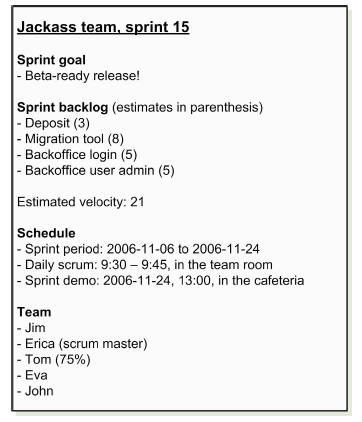

- After the sprint planning meeting, the Scrum master creates this page, puts it up on the wiki, and sends a spam to the whole company.
- In addition, the Scrum master prints out the sprint info page and posts it on the wall outside his team room. So anybody walking by can look at the sprint info page to find out what that team is doing.
- When the sprint nears the end, the Scrum master reminds everybody
about the upcoming demo.
- Given all this, nobody really has an excuse *not* to know what’s going on.

# Part Six - How we do sprint backlogs

- This needs to be done *after* the sprint planning meeting, but *before* the first daily scrum.

## Sprint-backlog format

- What we have found to be the most effective format for the sprint backlog – a wall-based task board! (a.k.a. Scrum boards)
- For a distributed team, use a tool that provides a Scrum board view, and put it on a big screen at each site. 
  - At the daily scrum, everyone stands at the wall screen and talks via Skype (or equivalent).

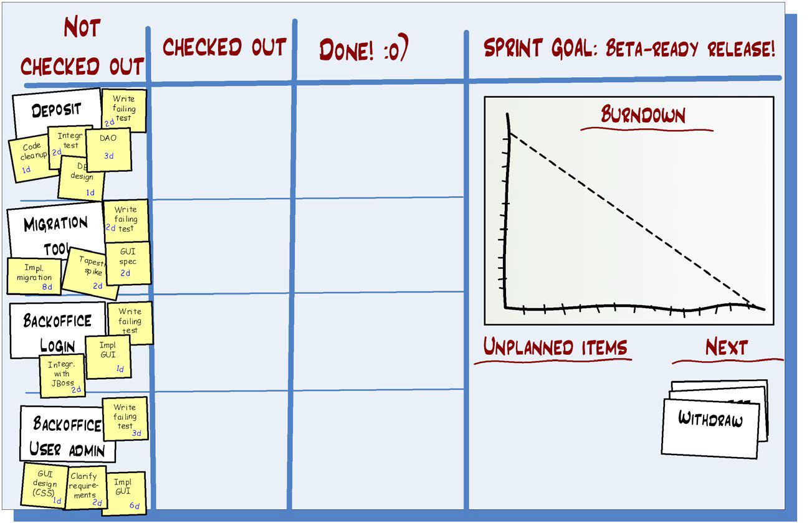

## How the task board works

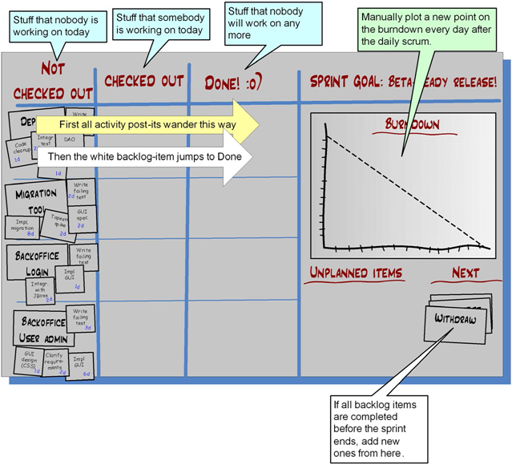

- Simplicity is extremely valuable for these types of things, so I only add additional complications when the cost of not doing so is too great.

### Example 1: After the first daily scrum

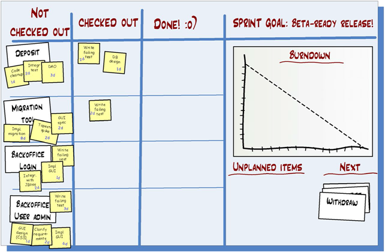

- Sometimes, for larger teams, a task gets stuck in “Checked out” because nobody remembers who was working on it. Labeling each checked-out task with the name of the person who checked it out.
- Just about all teams use avatars nowadays. Each team member picks their avatar (a South Park figure or something), prints them, and puts them on magnets. Great way to see who is working on what.
- if each person only has like two magnets, that indirectly limits work in progress and multitasking.

### Example 2: After a few more days

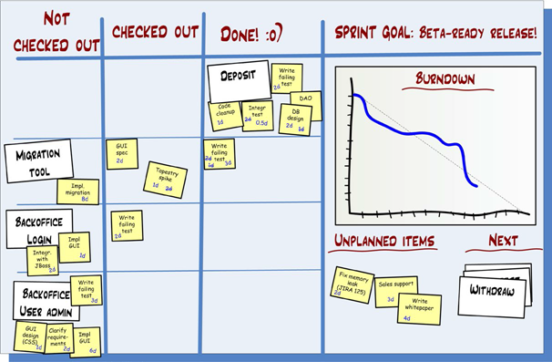

- Completed Deposit story
- Migration Tool is partially complete
- Backoffice Login is started
- Backoffice User Admin is not started
- Three unplanned items, useful to remember when you do the sprint retrospective

- Sprint backlog near the end of a sprint does get rather messy, but that’s OK since it is shortlived. Every new sprint, we create a fresh, clean, new sprint backlog.

## How the burn-down chart works

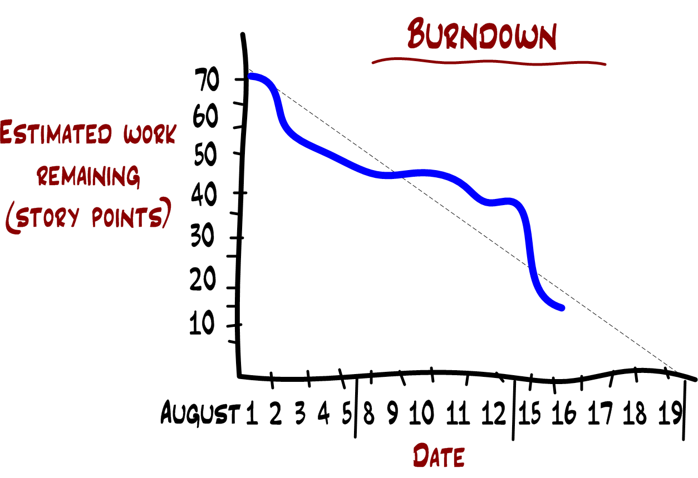

This chart shows that:
- On the first day, the team estimated 70 story points of work left to do. This was the estimated velocity of the whole sprint.
- On August 16, the team estimates 15 story points of work left to do. The dashed trend line shows that they are approximately on track, i.e. complete everything by the end of the sprint.
- Now, they increasingly skip burn-down charts entirely, because one glance at the Scrum board gives them the info they need.

## Task-board warning signs

- The Scrum master is responsible for making sure that the team acts upon warning signs such as:

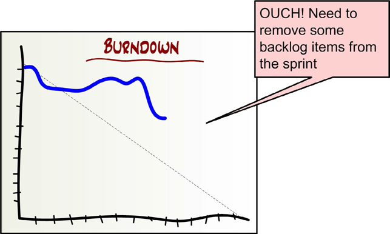  _

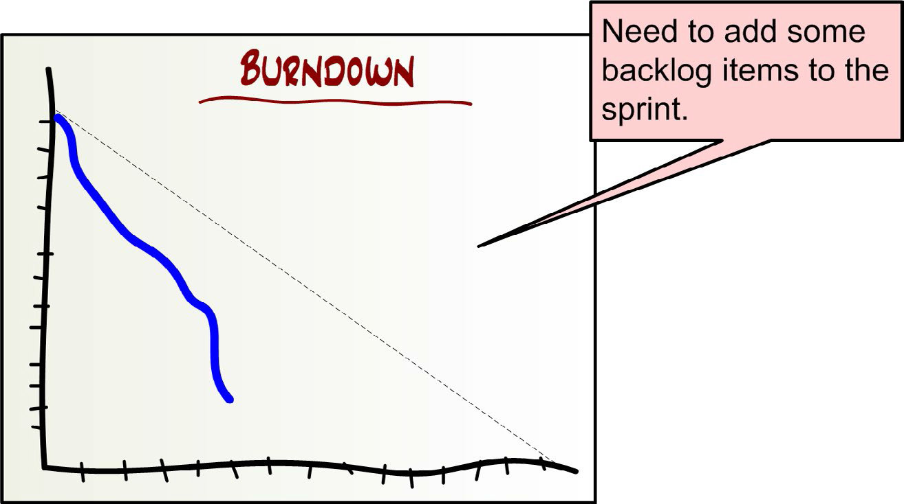  _

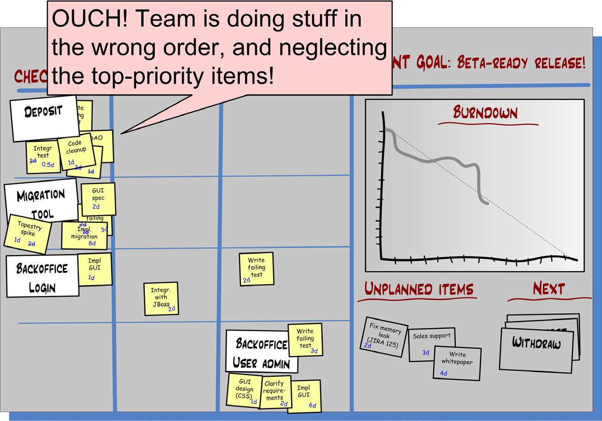  _

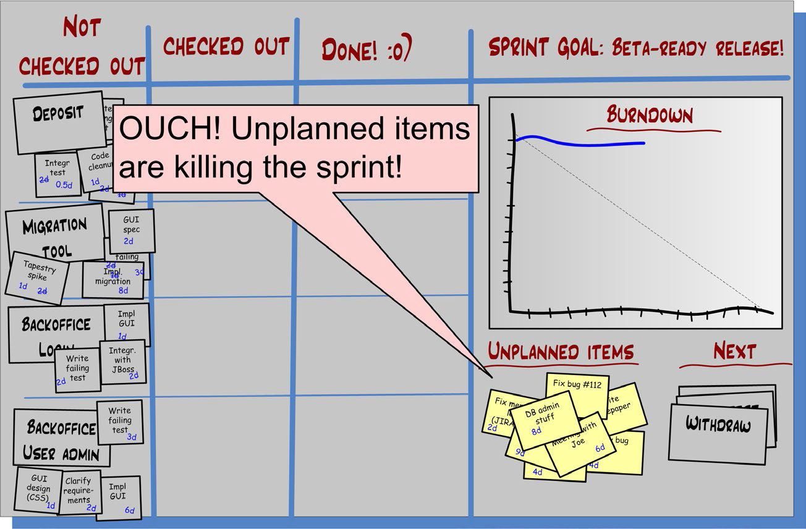  _

## Hey, what about traceability?!

- Take a digital photo of the task board every day. 
  - I do that sometimes but never find a need to dig up those photos.
- Once the sprint is done and working code has been delivered and documentation checked in, no one care about the past.
- Some tools provide that type of data but people basically never use it. 
- Your code-version-control system will give you most of what you need. Writing the story ID in your commit comment.

## Estimating days vs. hours

- Skip estimating tasks entirely!
- Most teams eventually learn how to break their work into tasks that are roughly a day for one to two people.
- Burn-down charts can still be used (if you must) – in that case, just count the tasks instead of adding up the hours.

# Part Seven - How we arrange the team room

-  Many of the most interesting and valuable design discussions take place spontaneously in front of the task board.
- For this reason, we try to arrange this area as an explicit “design corner”.

-  There is no better way to get an overview of the system than to stand in the design corner and glance at both walls

## Seat the team together!

- After eight years of helping companies with Scrum, I’d like to add: **SEAT THE TEAM TOGETHER!**
-  If there is no space for the team, make space.
- After just one sprint, the team will agree that it was a good idea to move together
- “Together” means:
  - **Audibility**: Anybody in the team can talk to anybody else without shouting or leaving his desk.
  - **Visibility**: Everybody in the team can see everybody else. Everyone can see the task board.
  - **Isolation**: There is nobody outside the team close enough to be disturbed. And vice versa.
-  If you have a distributed team? Well, then you are out of luck

## ~~Keep the product owner at bay~~

- The best teams I’ve seen have the product owner embedded. Teams suffer a lot when the product owner is too far away, and that’s a much bigger problem than being too close.
- He shouldn’t spend ALL the time with the team. But, generally speaking, the closer the better.

## Keep the managers and coaches at bay

- If you are Scrum coach (and perhaps also a manager), do get involved as closely as possible. But only for a limited period. 
  - Check up on the team once in a while (not too often) by attending sprint demos and looking at the task board and listening in on morning scrums. 
  - If you see an improvement area, take the Scrum master aside and coach him. Not in front of the team.
  - Another good idea is to attend sprint retrospectives, if your team trusts you enough not to let your presence clam them up.

> As for well-functioning Scrum teams, make sure they get everything they need, then stay the hell out of the way (except during sprint demos).
  
- Ask “What does this team need in order to manage itself?” rather than “How can I manage this team?”
- They need things like transparency, clear purpose, a fun and motivating work environment, air cover, and an escalation path for impediments.

# Part Eight - How we do daily scrums

- Daily scrum is really important! It’s the point where most synchronization happens and where the team raises important impediments. 
- The Scrum Guide recently updated the three questions to counter this:
  - What did I do yesterday that helped our team meet the sprint goal?
  - What will I do today to help our team meet the sprint goal?
  - Do I see any impediments that prevent me or our team from meeting
the sprint goal?
- Notice the focus on the sprint goal, the team’s shared high-level purpose!
- Whatever you do, don’t let daily scrums stay boring. Keep experimenting!

## How we update the task board

- We normally update the task board during the daily scrum.
  - Sometimes the Scrum master does the Post-it stuff while people talk.
  - Some teams have a policy that each person should update the task board *before* each meeting. 
- Many teams spend time updating numbers on sticky notes during the daily scrum. Waste! The purpose of the daily scrum is to get synchronized, so I usually find it best to update the board “in real time” 
- That way the daily scrum is used to actually *communicate* rather than administrate.

## Dealing with latecomers

- Some teams have a can of coins and bills. When you are late, even if only one minute late, you add a fixed amount to the can. 
- If you call before the meeting and say you’ll be late, you still have to pay up.
- The money in the can is used for social events.

              
- Just make sure the team comes up with it themselves; don’t impose a scheme from above or outside the team. And keep it fun.

## Dealing with “I don’t know what to do today”

- If I am Scrum master I just move on and let the next guy talk, but make note.
- I go through the task board with the whole team. I invite people to add more Post-its. 
- Then I go back to those people who didn’t know what to do: “Now that we’ve gone through the task board, do you have any ideas about what you can do today”? Hopefully, they will.
- If not, I consider if there is any pair-programming opportunity here. That usually works
- And if that doesn’t work, here’s the next trick.

> ** Scrum master**: OK, who wants to demonstrate the beta-ready release to
us? (Assuming that was the sprint goal.)  
> **Team**: (Confused silence.)  
> **Scrum master**: Aren’t we done?  
> **Team**: Um... no.  
> **Scrum master**: Oh darn. Why not? What’s left to do?  
> **Team**: Well we don’t even have a test server to run it on, and the build script is broken.  
> **Scrum master**: Aha. (Adds two Post-its to the task wall.) Joe and Lisa, how can you help us today?  
> **Joe**: Um.... I guess I’ll try to find some test server somewhere.  
> **Lisa**: And I’ll try to fix that build script.

- If you have achieved your sprint goal in mid-sprint:
  - Congratulate the team on a job well done
  - grab one or two of the stories from the “next” section at the bottom right of your task board, and move them to the “not checked out” column to the left. 
  - Then redo the daily scrum. 
  - Notify the product owner that you have added some items to the sprint.
- Or use the time to pay off some technical debt, or do some technical exploration. Keep the product owner in the loop though.
- But what if the team has not yet achieved the sprint goal and Joe and Lisa still refuse to come up with something useful to do?
  - **Shame**: “Well, if you have no idea how you can help the team, I suggest you go home, or read a book or something. Or just sit around until someone calls for your help.
  - **Old school**: Simply assign them a task.
  - **Peer pressure**: “Feel free to take your time, Joe and Lisa, we’ll all just stand here and take it easy until you come up with something to do that will help us reach the goal.”
  - **Servitude**: “Well, you can help the team indirectly by being butlers today.
- If one person frequently forces you to go that far, then you should probably take that person aside and do some serious coaching.
- If the problem still remains, you need to evaluate whether this person is important to your team or not.
  - If he *isn’t* too important, try to get him removed from your team.
  - If he *is* important, then try to pair him up with somebody else who can act as his shepherd. 
    
- The “I don’t know what to do today” problem is typical for teams that are new to Scrum, and are used to having other people decide things for them.
- As they get more experienced with self-organization, the problem disappears. People learn to figure out what to do.

> If you are a Scrum master and you find yourself resorting to the above tricks too often, you should consider taking a step back. Despite your helpful intention, you may be the team’s biggest impediment, stopping them from learning how to self-organize!

# Part Nine - How we do ~~sprint demos~~ sprint review

- The official term is the “sprint review”. Demo implies a one-way communication, while review implies a two-way communication.
- Sprint review is all about feedback!

## Why we insist that all sprints end with a demo

- A well-executed sprint demo has a profound effect:
  - The team gets credit for their accomplishment. They *feel good*.
  - Other people learn what your team is doing.
  - The demo attracts vital feedback from stakeholders.
  - Demos are a social event that is valuable.
  - Doing a demo forces the team to *actually finish stuff* and release it
    - Without demos, we kept getting huge piles of 99%-finished stuff. 
    - With demos, we may get fewer items done, but those items are *really done*.
- If they don’t have much that really works, the demo will be embarrassing. This hurts. But the next sprint, the team will really try to get stuff *done*!
- This is extra crucial in a multi-team context. Everyone involved needs to see the integrated product come together on a regular basis.
- Self-organization only works with transparency and feedback loops, and a well-executed sprint review provides both.

## Checklist for sprint demos

- Present the sprint goal
- Don’t spend too much time preparing the demo presentation. Focus on actual working code
- Making the demo faswt-paced rather than beautiful
- Keep the demo on a business-oriented level. 
  - Focus on “what did we do” rather than “how did we do it”.
- If possible, let the audience try the product for themselves.
- Don’t demonstrate a bunch of minor bug fixes and trivial features. Mention them but don’t demo them.

- Some teams do two reviews: 
  - a short public review, aimed at external stakeholders.
  - an internal review with more details.
    - A great way to spread knowledge between teams, and spare stakeholders from techy details they don’t care about.
    
## Dealing with indemonstrable stuff

> **Team member**: I’m not going to demonstrate this item, because it can’t be demonstrated. The story is “Improve scalability so system can handle 10,000 simultaneous users”. I can’t bloody well invite 10,000 simultaneous users to the demo can I?  
> **Scrum master**: Are you done with the item?  
> **Team member**: Yes, of course.  
> **Scrum master**: How do you know?  
> **Team member**: I set the system up in a performance-test environment, started eight load servers, and pestered the system with simultaneous requests.  
> **Scrum master**: But do you have any indication that the system will handle 10,000 users.  
> **Team member**: Yes. The test machines are crappy, yet they could handle 50,000 simultaneous requests during my test.  
> **Scrum master**: How do you know?  
> **Team member** (frustrated): Well, I have this report! You can see for yourself. It shows how the test was set up and how many requests wee sent!  
> **Scrum master**: Oh, excellent! Then there’s your “demo”. Just show the report and go through it with the audience. Better than nothing right?.  
> **Team member**: Oh, is that enough? But it’s ugly. I need to polish it up.  
> **Scrum master**: OK, but don’t spend too long. It doesn’t have to be pretty, just informative.  

# Part Ten - How we do sprint retrospectives

- The most important thing about retrospectives is to *make sure they happen*.
- Ironically, the more stressed you are, the more likely you are to want to skip the retrospective.
- But the more stressed you are, the more badly you need the retrospective!

> "I’m in such a hurry to chop down trees, I don’t have time to stop
and sharpen my saw!"

- For two-week sprints, time-box the retrospective to one hour. 
- Do a longer (half-day or full-day) retrospective every couple of months so you can deal with the thornier issues.
- The likelihood of getting buy-in from the team is very much higher if the idea comes “from the team”.
- Without retrospectives you will find that the team keeps making the same mistakes over and over again.

## How we organize retrospectives

- we do it something like this:
  - one to three hours
  - Participants: the product owner, the whole team, and myself.
  - a closed room, a cozy sofa corner, the rooftop patio, or some place like that.
  - don’t do retrospectives in the team room, since people’s attentions will tend to wander.
  - Somebody is designated as secretary.
  - The Scrum master shows the sprint backlog and summarizes the sprint.
  - We do “the rounds”.
    - what they thought was good
    - what they think could have been better
    - what they would like to do differently next sprint.
  - Look at the estimated vs. actual velocity.
  - Scrum master tries to summarize concrete suggestions about what we can do better next sprint.
  
  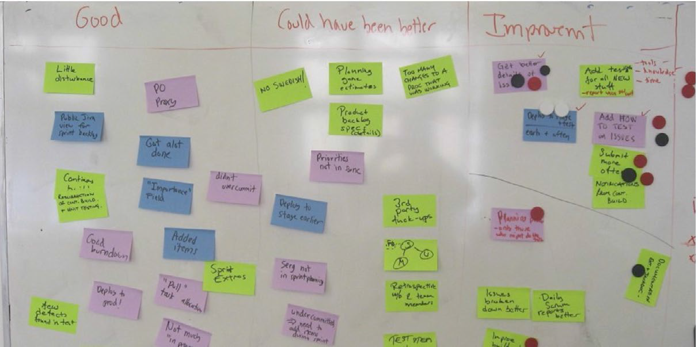
  
Three columns:
- **Good**: We will redo the same again.
- **Could have done better**: we will do these things differently.
- **Improvements**: Concrete ideas about how we could improve in the future.

- They used “dot voting” to determine which improvements to focus on during next sprint.
- Based on this, they selected five process improvements to focus on, and will follow this up during next retrospective.

- There are lots of fancy ways to do retrospectives. You’ll find lots of ideas in the book Agile Retrospectives. 
- Retromat, a random retrospective generator, is fun, too (www.plans-for-retrospectives.com). :o)
- I keep coming back to the simple format described above. It works for the majority of cases.
- Or even simpler, take a 20-minute coffee break with two discussion topics: “What to keep” and “What to change”. A bit shallow, but better than nothing!

## Spreading lessons learned between teams

- If sales manager keeps kidnapping programmers, invite the sales manager to a meeting, learn about their needs, and discuss possible solutions together!
- One person (in this case, me) attends all sprint retrospectives and acts as the knowledge bridge. Quite informal.
- An alternative would be to have each Scrum team publish a sprintretrospective report. We have tried that but found that not many people read such reports.
- Important rules for the “knowledge bridge” person:
  - He should be a good listener.
  - If the retrospective is too silent, he should be prepared to ask simple but well-aimed questions that stimulate discussion
  - Willing to spend time visiting all retrospectives
  - He should be in some kind of position of authority, so he can act upon improvement suggestions.
  
- Trading facilitators is a nice pattern. Like “I’ll facilitate for your team retrospective if you facilitate for mine.”
- This allows you as Scrum master to fully participate in your team’s retrospective (rather than facilitate).

## To change or not to change

- We’ve found that, in many cases, just identifying a problem clearly is enough for it to solve itself automatically next sprint.
- Every change you introduce has some kind of cost so, before introducing changes, consider doing nothing at all.
- “we communicated too little within the team...” is a typical example.
- If you introduce a new change every time, people may become reluctant to reveal minor problem areas.

## Examples of things that may come up during retrospectives

### “We should have spent more time breaking down stories into sub-items and tasks”

- At the daily scrum, team members find themselves saying “I don’t really know what to do today.”
- So after each daily scrum, you spend time finding concrete tasks. Usually more effective to do that up front.

**Typical actions**: None.

## “Too many external disturbances”

**Typical actions**:

- Record disturbances better next sprint
- try to funnel all disturbances to the Scrum master or product owner
- Ask the team to designate one person as “goalkeeper”. All disturbances are routed to him.
  - Could be the Scrum master or a rotating position.

- The rotating goalkeeper pattern is extremely common and usually works well. Try it!

## “We overcommitted and only got half of the stuff done”

**Typical actions**: None.

- “sprint commitment” has been renamed “sprint forecast”.
- The sprint plan is not a commitment, it’s a forecast and a hypothesis.
- It still kind of sucks to consistently deliver less than forecasted. If that is a problem, start strictly applying yesterday’s weather.

## “Our office environment is too noisy and messy”

**Typical actions**:

- Try to create a better environment, or move the team offsite. Rent a hotel room.
- Tell the team to reduce the forcast. Hopefully, this will cause the product owner to start pestering upper management about this

# Part Eleven - Slack time between sprints

- In real life, you can’t always sprint. You need to rest between sprints.
- Slack is superimportant for both productivity and personal well being!
- Open your calendar and block off half a day per week, write “slack” or “unbookable” or something.
- After the sprint demo and retrospective, both the team and the product owner will be full of information and ideas to digest. 
  - If they immediately run off and start planning the next sprint, chances are nobody will have had a chance to digest any information or lessons learned
- We try to make sure that the sprint retrospective and the subsequent sprint planning meeting don’t occur on the same day.

**Bad**:

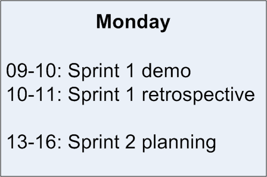

**Better**:

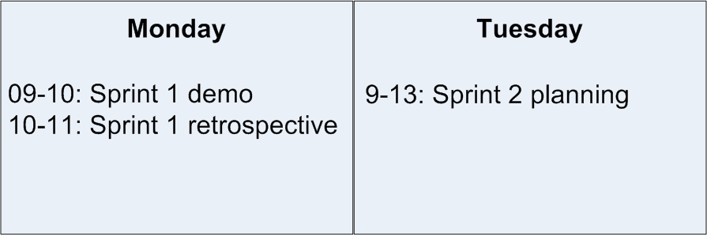

**Even Better**:

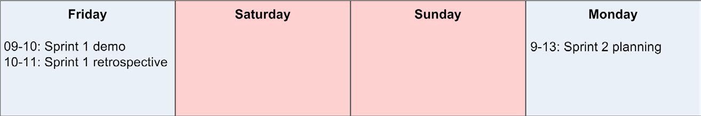

**Best?**:

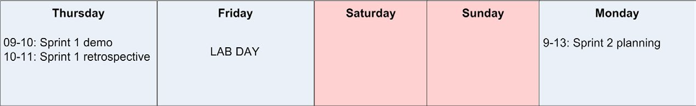

- "lab days" = days where developers are allowed to do essentially whatever
they want. ~Google's 20% time policy
- Currently, we have lab days once per month.
- The whole company takes the lab day at the same time. Otherwise, people tend to not take it seriously.
- At Spotify, we ended up doing companywide hack weeks. Twice per year, we do a whole week of do-whateveryou-want, with a demo and party on Friday. Check it out at [http://tinyurl.com/spotifyagile](http://tinyurl.com/spotifyagile)

# Part Twelve - How we do release planning and fixed-price contracts

- Sometimes, We need to plan ahead more than one sprint at a time – typically, in conjunction with a fixed-price contract.
- Typically, release planning for us is an attempt to answer the question “when, at latest, will we be able to deliver version 1.0 of this new system”.
- I suggest you instead buy Mike Cohn’s book, [*Agile Estimating and Planning*](https://www.amazon.com/Agile-Estimating-Planning-Mike-Cohn/dp/0131479415).
- Also check out the book [*Lean Startup*](https://www.amazon.com/Lean-Startup-Entrepreneurs-Continuous-Innovation/dp/0307887898), by Eric Ries. 
- A big problem is that most projects tend to build up to a big-bang release, instead of delivering small increments.

## Define your acceptance thresholds

- The product owner defines a list of *acceptance thresholds*, which is a simple classification of what the importance levels in the product backlog actually mean in terms of the contract.

| Importance | Name |
| --- | --- |
| red | banana |
| red | apple |
| red | orange |
| red | guava |
| red | pear |
| yellow | raisin |
| yellow | peanut |
| yellow | donut |
| yellow | onion |
| green | grapefruit |
| green | papaya |
| green | blueberry |
| green | peach |

Red = *must* be included in version 1.0  
Yellow = *should* be included in version 1.0  
Green = may be done later  

## ~~Time-estimate~~ Size-estimate the most important items

- In order to do release planning, the product owner needs estimates, at least for all stories that are included in the contract.
- Just like when sprint planning, this is cooperative effort between the product owner and the team.
- All that was just a long-winded way of saying:
  - Let the team do the estimates.
  - Don’t make them spend too much time.
  - Make sure they understand that the time estimates are crude estimates,
not commitments.
- Usually, the product owner tells the team that the goal of this meeting is to time-estimate the top 20 (or whatever) stories in the product backlog.
- He goes through each story once, and then lets the team get to work. The product owner stays in the room to answer questions and clarify.
- This meeting must be strictly time-boxed.
- The team must make sure that the impact of these meetings on their current sprints is clearly visible to the product owner. Work doesn't come for free.

| Importance | Name | Estimate |
| --- | --- | --- |
| red | banana | 12 |
| red | apple | 9 |
| red | orange | 20 |
| red | guava | 8 |
| red | pear | 20 |
| yellow | raisin | 12 |
| yellow | peanut | 10 |
| yellow | donut | 8 |
| yellow | onion | 10 |
| green | grapefruit | 14 |
| green | papaya | 4 |
| green | blueberry | |
| green | peach | _ |

- Call them “size estimates” instead. 
  - I don’t know how long “banana” will take, but I’m pretty sure it’s a bit longer than “apple” and a lot shorter than “orange

> Better to be roughly right than precisely wrong!

## Estimate velocity

- Ask the team to stare at the list and make an educated guess of how far they can get in one sprint. Count up the points. That will be faster than focus factor, and about as accurate/inaccurate.

## Put it together into a release plan

| Importance | Name | Estimate |
| --- | --- | --- |
|  | **Sprint 1** |   |
| red | banana | 12 |
| red | apple | 9 |
| red | orange | 20 |
|  | **Sprint 2** |   |
| red | guava | 8 |
| red | pear | 20 |
| yellow | raisin | 12 |
|  | **Sprint 3** |   |
| yellow | peanut | 10 |
| yellow | donut | 8 |
| yellow | onion | 10 |
| green | grapefruit | 14 |
|  | **Sprint 4** |   |
| green | papaya | 4 |
| green | blueberry | |
| green | peach | _ |

- Each sprint includes as many stories as possible without exceeding the estimated velocity of 45.
- Now we can see that we’ll probably need three sprints to finish all the “must haves” and “should haves”.
- We usually add a significant buffer to protect against bad time estimates, unexpected problems, unexpected
- So in this case, we might agree to set the delivery date to three months in the future, giving us one month “reserve”.

- Here’s an alternative approach that works nicely. Estimate velocity as a
range (30-50 points). Then split the backlog into three lists:
  - **All**: These stories will all be done, even if our velocity is low (30).  
  - **Some**: Some of these stories will be done, but not all.  
  - **None**: None of these stories will be done, even if our velocity is high (50).  

## Adapting the release plan

> Reality will not adapt itself to a plan, so it must be the other way around.

- If the actual velocity was very different from the estimated velocity, we revise the estimated velocity for future sprints and update the release plan.
- If this puts us into trouble:
  - The product owner may start negotiating with the customer 
  - or start checking how he can reduce scope without breaking the contract. 
  - Or perhaps he and the team come up with some way to increase velocity or increase focus factor by removing some serious impediment
  
- Not good news to the customer perhaps, but at least we are being honest
and giving the customer an early choice.
- I made a 15-minute video called “Agile Product Ownership in a Nutshell”. Check it out! [http://tinyurl.com/ponutshell](http://tinyurl.com/ponutshell)

# Part Thirteen - How we combine Scrum with XP

- Scrum focuses on management and organization practices while XP focuses mostly on actual programming practices. That’s why they work well together.
- I learned from Jeff Sutherland that the first Scrum actually did all the
XP practices.
- Ken Schwaber convinced him to leave the engineering practices out of Scrum, to keep the model simple and help spread Scrum faster.
  - The downside is that a lot of teams suffer because they lack the technical practices that enable sustainable agile development.
- Not all our teams have managed to adopt all practices.
- Some XP practices are directly addressed
by Scrum and can be seen as overlapping

## Pair programming

Some conclusions so far about pair programming:

- Pair programming does improve code quality.
- Pair programming does improve team focus.
- Many developers that are strongly against pair programming actually haven’t tried it, and quickly learn to like it once they do try it.
- Pair programming is exhausting and should not be done all day.
- Shifting pairs frequently is good.
- Pair programming does improve knowledge spread within the group. Surprisingly fast, too.
- Some people just aren’t comfortable with pair programming.
- Code review is an OK alternative to pair programming.
- The “navigator” (the guy not using the keyboard) should have a computer of his own, as well. For browsing documentation when the “driver” (the guy at the keyboard) gets stuck, etc.
- Don’t force pair programming upon people. Let them experiment with it at their own
pace.

## Test-driven development (TDD)

- I’ve realized that TDD is a pretty niche technique that very few people have the patience to master. Instead, I teach the techniques and then let teams decide how much of it to do, and when.
- Some reflections on test-driven development:
  - TDD is *hard*. It takes a while for a programmer to *get it*.
  - In many cases, the only way for a programmer to get it is to have him pair-program with somebody else who is good at TDD.
  - Once a programmer does get it, however, he will usually be severely infected and will never want to work in any other way.
  - TDD has a profoundly positive effect on system design.
  - It takes time to get TDD up and running effectively in a new product, but the return on investment is fast.
- Since TDD is so hard, I don’t try to force it on people, instead I coach these principles:
  1. Make sure each key feature has at least one end-to-end acceptance test, interacting through the GUI or just behind it.
  2. Make sure any complex or business-critical code is covered by unit tests.
  3. This will leave some code uncovered. That’s fine. Make sure it’s a deliberate tradeoff rather than just neglect.
  4. Write the tests as you go, don’t save them for later.
- Test coverage usually ends up around 70%, because of the law of diminishing returns.

> In short, test automation is crucial, but TDD is optional.

- In our most sophisticated products (from a TDD perspective), we have automated black-box acceptance tests.
  - These tests start up the whole system in memory, including databases and webservers, and access the system using only its public interfaces (for example HTTP).
  
### TDD on new code

- We do TDD for all new development, even if that means initial project
setup takes longer The benefits are so great that there really is no excuse not to do TDD.

### TDD on old code

- TDD is hard, but trying to do TDD on a codebase that wasn’t built using TDD from start... that’s *really hard*!
- A great one about legacy code called Working Effectively with Legacy Code, by Michael Feathers. 
  - I’ve also written some articles on technical debt, check my blog. [http://blog.crisp.se/tag/technical-debt](http://blog.crisp.se/tag/technical-debt)
- We spent quite a lot of time trying to automate integration testing in one of our more complex systems, a codebase that had been around for a while and was in a severely messed-up state and completely devoid of tests.
- **Lesson learned**: If you are stuck with having to do manual regression testing, and want to automate this away, don’t (unless it is really easy).
  - Instead, build stuff that makes manual regression testing easier. Then consider automating the actual testing.
  
## Incremental design

- This means keeping the design simple from start and continuously improving it.
  - We spend a reasonable amount of time refactoring and improving existing design, and we rarely spend time doing big up-front designs.
- Continuous design improvement is mostly an automatic side effect of doing TDD.

## Continuous integration

- This is extremely valuable and timesaving.
- It is the ultimate solution to the good ol’ “hey, but it works on *my* machine” issue.
- Every time someone checks something in to the version-control system, the continuous-build server will wake up, build everything from scratch on a shared server, and run all the tests.
- Every night, the continuous-build server will rebuild the product from scratch and publish binaries, documentation, reports, etc. Some products will also be automatically deployed to a test environment.
- **Continuous delivery**: Every commit is a release candidate, and releasing is a single-click operation.
- I suggest you read (or at least browse) the book *Continuous Delivery*. 
  - Setting it up is a lot of work, but definitely worth doing at the beginning of any new product. Pays off almost immediately.
  
## Collective code ownership

- Pair programming with frequent rotation of pairs automatically leads to a high level of collective code ownership.
- Teams with a high level of collective code ownership have proven to be very robust – for example, their sprint doesn’t die just because some key person is sick.
- Spotify have an “internal open source” model. All code lives in an internal GitHub and people can clone repos and issue pull requests. Very convenient.

## Informative workspace

- All teams have access to whiteboards and empty wall space and make quite good use of this.
- Coding standard
  - Most programmers have their own distinct coding style.
  - In some cases, the difference doesn’t matter; in other cases it can lead to a severely inconsistent system design and hard-to-read code.
  - Here are some examples from our code standard:
    - Use the Sun code conventions by default: ~~http://java.sun.com/docs/
codeconv/html/CodeConvTOC.doc.html~~ [http://www.oracle.com/technetwork/java/codeconvtoc-136057.html](http://www.oracle.com/technetwork/java/codeconvtoc-136057.html)
    - Never, ever, ever catch exceptions without logging the stack trace or rethrowing. log.debug() is fine, just don’t lose that stack trace.
    - Use setter-based dependency injection to decouple classes from each other.
    - Avoid abbreviations.
    - Methods that return Collections or arrays should not return null.
  - No need to reinvent the wheel – you can copy this one from my friend Google: ~~http://google-styleguide.googlecode.com~~ [https://github.com/google/styleguide](https://github.com/google/styleguide)
  
## Sustainable pace/energized work

- Extended overtime is counterproductive in software development. After some unwilling experimentation on this, I can only agree wholeheartedly!
- In software development (and any other complex, creative work), there’s very little correlation between hours spent and value delivered.

> What counts is *focused, motivated* hours.

- So don’t force people to work overtime, except in the rare exceptional case where it’s really needed for a short period of time.

> Burning people out is Evil.

# Part Fourteen - How we do testing

- This is the hardest part.
- Testing is the part that probably will vary most between different organizations.

## You probably can’t get rid of the acceptance-test phase

- In the ideal Scrum world, a sprint results in a potentially deployable version of your system.
- Manual testing is important and to some extent is unavoidable. But it should be done by the team in the sprint.

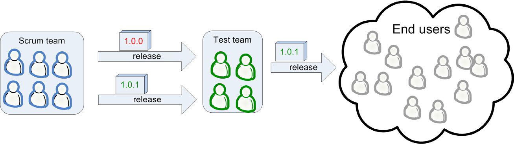

- When I say “acceptance-test phase” I am referring to the whole period of testing, debugging, and re-releasing until there is a version good enough for production release.

## Minimize the acceptance-test phase

- The acceptance test phase hurts. It feels distinctly un-agile.
- I’ve seen how really agile companies move fast *and* increase quality by getting rid of the separate acceptance-test phase and merging that work into the sprint.
- Minimize the amount of time needed for the acceptance test phase. This is done by:
  - Maximizing the quality of the code delivered by the Scrum team.
    - Put testers in the Scrum team.
    - Do less per sprint.
  - Maximizing the efficiency of the manual test work.
  
## Increase quality by putting testers in the Scrum team

- Scrum teams are supposed to be cross-functional!
- “Cross-functional” doesn’t mean everyone knows everything. It just means that everyone is willing to do more than just their own thing.
- The tester will guide this work, pair with developers on test automation, and personally do the more complex manual testing.

## The tester is the “sign-off guy”

-  I’m not a big fan of the sign-off guy pattern any more. It introduces a bottleneck and puts too much responsibility in the hands of one person.
-  But I can see it being useful under some circumstances. Also, if anyone should sign off on the quality, it should be a real user.

- But if you have one, here are some guidelines:
  - I’ve found that developers often say something is done when it really isn’t. Even if you have a very clear definition of “done”.
  - How does testers know something is done then? Well, first of all, he should (surprise) *test* it!
  - Once Mr. T has tested the feature, he should go through the “done” checklist (if you have one) with the developer.
  - A nice side effect of this is that the team now has a guy who is perfectly suited to organize the sprint demo.
  
## What does the tester do when there is nothing to test?

- First of all, he should be *preparing for tests*. That is, writing test specs, preparing a test environment, etc.
- If the team is doing TDD, the tester should pair-program with developers that are writing test code.
- A good tester usually comes up with different types of tests than a good developer does, so they complement each other.
- During the sprint planning meeting, the team tends to focus on *programming tasks*. However, usually, there are lots of *non-programming* tasks that need to be done in the sprint.
- Examples of non-programming tasks that often need to be done in a
sprint:
  - Set up a test environment.
  - Clarify requirements.
  - Discuss deployment details with operations.
  - Write deployment documents (release notes, RFC, or whatever your organization does).
  - Contact with external resources (GUI designers for example).
  - Improve build scripts.
  - Further break down stories into tasks.
  - Identify key questions from the developers and get them answered.
  
- What do we do if the tester becomes a bottleneck? 
  - We could make everybody in the team into tester’s assistants.

## Increase quality by doing less per sprint

- This goes back to the sprint planning meeting. Simply put, don’t cram too many stories items into the sprint!
- If you have quality problems, or long acceptance-test cycles, do less per sprint! This will almost automatically lead to higher quality.

> It is almost always cheaper to build less, but build it stable, rather than to build lots of stuff and then have to do panic hot fixes.

## Should acceptance testing be part of the sprint?

- Some of our teams include acceptance testing in the sprint. Most of our teams don't, for two reasons:
  - A sprint is time-boxed. Acceptance testing is very difficult to timebox.
  - If you have multiple Scrum teams working on the same product, the manual acceptance testing must be done on the combined result of both team’s work.
  
  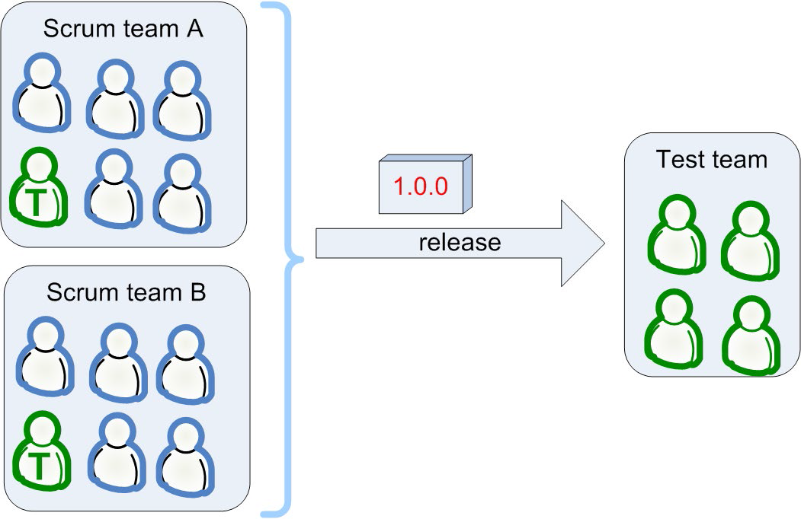
  
- Strive to make acceptance testing part of each sprint. It takes a while to get there, but you won’t regret it.
- Even if you never get there, the act of trying will cause you to make lots of improvements to the way you work.

## Sprint cycles vs. acceptance-test cycles

- I’ve seen real-world teams release to production every day, sometimes even several times per day.

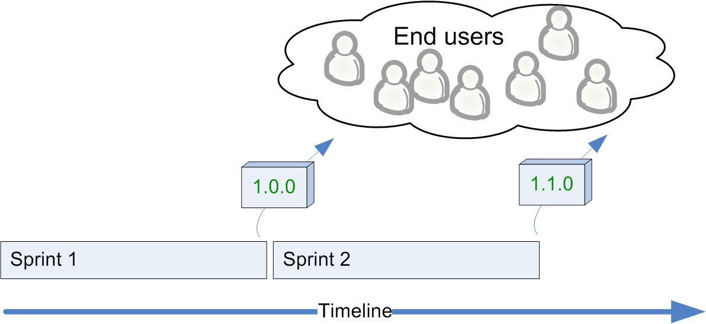

- Just roll up your sleeves, figure out what’s stopping you from getting releaseable code every sprint, and fix the problems one by one.
- Just take whatever your release cycle is today, and gradually but continuously shorten it.

Here’s a more realistic picture:

\* The diagonal red lines in Sprint 2 symbolize chaos.

- Well, the sad thing is that the problem remains even if you have an acceptance-test team. 
  - The only difference is that most of the bug reports will come from the test team instead of from angry end users.
  
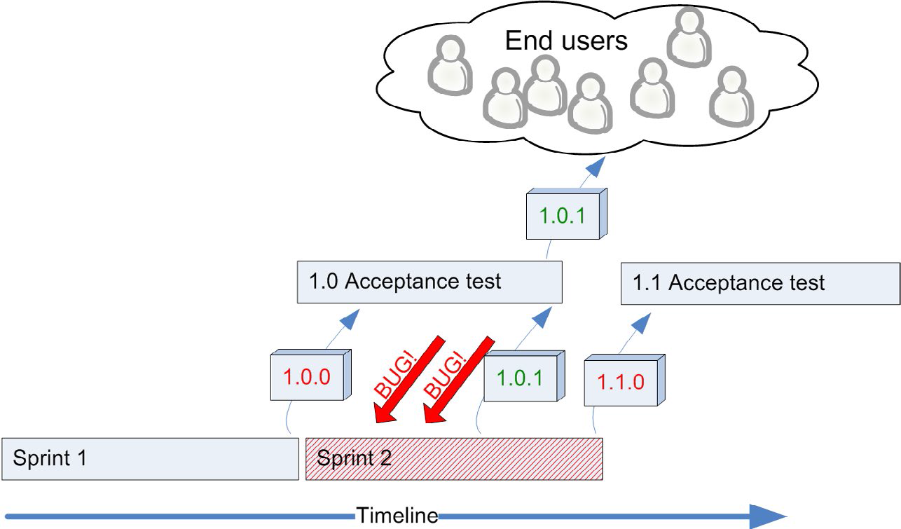

- We haven’t found any simple solution to this problem.
- The cost of finding and fixing bugs early, within a sprint, is just so extremely low compared to the cost of finding and fixing bugs afterwards.
- But the fact remains, even if we can minimize the number of bugs, there will still be bug reports coming after a sprint is complete.

### Approach 1: “Don’t start building new stuff until the old stuff is in production”

- We would have to add a nontime-boxed release period between sprints, where we do only testing and debugging until we can make a production release.

- Not if your definition of done is “in production”. In that case, you can start the next sprint immediately, because the code from last sprint is already in production.
- Even if you do manage to release continuously, you still need a way to deal with urgent bugs coming in. Because that will happen sometimes.
  - And the best way to deal with that is to leave a bit of slack in the sprint.
  
### Approach 2: “OK to start building new stuff, but prioritize getting the old stuff into production”

- We expect to be spending some time in the next sprint fixing bugs from the
last sprint.
- We make sure sprints are long enough to survive a fair amount of bug fixing from the previous sprint.
- Gradually, over a period of many months, the amount of time spent fixing bugs from previous sprints decreased.

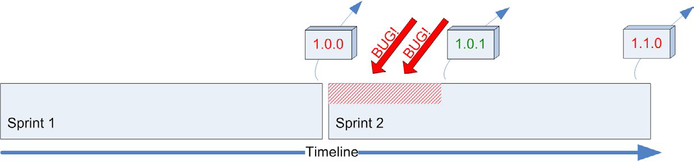

- Just use yesterday’s weather. Then your sprint will automatically have built-in slack to handle disruptions and hot fixes.

### Bad approach: “Focus on building new stuff”

-  This in effect means “focus on building new stuff *rather than getting old stuff into production*”.
- Many managers don’t really understand that, when all the coding is finished, you are usually still far from production release.
- All they have to do is limit the number of projects or features in progress.
  - I’ve seen cases where companies become literally seven times faster by doing that.
  - And better quality as well, because of the shorter feedback loop. Crazy but true.
  
## Don’t outrun the slowest link in your chain

- Let’s say acceptance testing is your slowest link.
  - Let’s say your acceptance-test team can test at most three features per week.
  - And let’s say your developers can develop six new features per week.
- It will be tempting for the managers or product owners (or maybe even the team) to schedule development of six new features per week.
- Don't! Instead, schedule three new features per week and spend the rest of the
time alleviating the testing bottleneck.
- We’ve tried all of these solutions (except the last one). The best longterm solutions are: better tools and scripts and test automation.
- Retrospectives are a good forum for identifying the slowest link in the
chain.

- This becomes self-adjusting if acceptance testing is included in the sprint. Make your definition of done include acceptance testing, and see.

## Back to reality

- We’ve sometimes managed to do this stuff:
  - We have testers in all Scrum teams, 
  - We have a huge acceptance test teams for each product that we release after each sprint, etc., etc.
- We’ve seen the positive effects of it. But we are still far from an acceptable quality-assurance process, and we still have a lot to learn there.