# Contents

- [Concept](#concept)
- [Documents](#documents)
- [Books](#books)
- [Knowledge](knowledge.html)
- [Training](training.html)
- [Exercises](exercises.html)
- [Useful Links](links.html)

# Concept

Test-Driven Development (TDD) is a technique for building software that guides software development by writing tests. TDD is a [software development process](https://en.m.wikipedia.org/wiki/Software_development_process) that relies on the repetition of a very short development cycle: requirements are turned into very specific [test cases](https://en.m.wikipedia.org/wiki/Test_case), then the software is improved to pass the new tests, only.

## The Three Steps of TDD

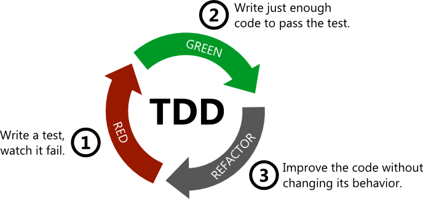  

1. __RED__: Write a test for the next bit of functionality you want to add.
2. __GREEN__: Write the functional code until the test passes.
3. __REFACTOR__: Clean up both new and old codes to makt it well structured and remove duplications.

_Source: [martinfowler.com](http://martinfowler.com/bliki/TestDrivenDevelopment.html)_

## The Three Rules Of TDD

1. You are not allowed to write any production code unless it is to make a failing unit test pass.
2. You are not allowed to write any more of a unit test than is sufficient to fail; and compilation failures are failures.
3. You are not allowed to write any more production code than is sufficient to pass the one failing unit test.

You must begin by writing a unit test for the functionality that you intend to write.

But by rule 2, you can't write very much of that unit test. As soon as the unit test code fails to compile, or fails an assertion, you must stop and write production code.

But by rule 3 you can only write the production code that makes the test compile or pass, and no more.

_Source: [butunclebob.com](http://butunclebob.com/ArticleS.UncleBob.TheThreeRulesOfTdd)_

## TDD and ATDD

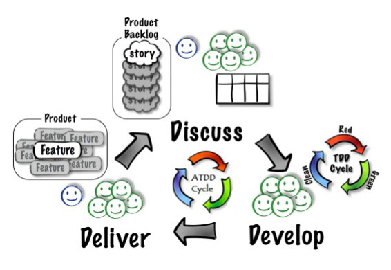

Test-driven development is related to, but different from [acceptance test–driven development](https://en.wikipedia.org/wiki/Acceptance_test%E2%80%93driven_development) (ATDD).

**TDD is primarily a developer’s tool to help create well-written unit of code** (function, class, or module) that correctly performs a set of operations. **ATDD is a communication tool between the customer, developer, and tester to ensure that the requirements are well-defined.**

TDD requires test automation. ATDD does not, although automation helps with regression testing. Tests used in TDD can often be derived from ATDD tests, since the code units implement some portion of a requirement. ATDD tests should be readable by the customer. TDD tests do not need to be.

_Source: [Wikipedia](https://en.wikipedia.org/wiki/Test-driven_development#TDD_and_ATDD)_

## TDD and BDD

  
_Source: [Abhay Kumar - LinkedIn](https://www.linkedin.com/pulse/behavior-driven-development-tools-java-developers-abhay-kumar)_

BDD ([behavior-driven development](https://en.wikipedia.org/wiki/Behavior-driven_development)) **combines practices from TDD and from ATDD. It includes the practice of writing tests first, but focuses on tests which describe behavior**, rather than tests which test a unit of implementation. Tools such as Mspec and Specflow provide a syntax which allow non-programmers to define the behaviors which developers can then translate into automated tests.

_Source: [Wikipedia](https://en.wikipedia.org/wiki/Test-driven_development#TDD_and_BDD)_

# Documents

## SAP

- [Agile Software Engineering, OPA5, UI5, Test Automation](https://s3-ap-southeast-1.amazonaws.com/pacroy/Agile+Software+Engineering%2C+OPA5%2C+UI5%2C+Automation.pptx) by SAP - *June 18, 2016*
- [Automated Testing](https://s3-ap-southeast-1.amazonaws.com/pacroy/Automated+Testing.pptx) by Sarah Lottman, SAP - *Septenber 2016*
- [SAP Test Automation](https://s3-ap-southeast-1.amazonaws.com/pacroy/SAP+Test+Management.pdf) by SAP, *July 2012*
- [ABAP Code Refacotring Techniques](https://s3-ap-southeast-1.amazonaws.com/pacroy/abap_code_refactoring_techniques.pdf) by Sukru Ilkel Birakoglu, SAP LABS France - *July 6, 2009*

## TOSCA

- [What's New in Tosca 9.3](https://s3-ap-southeast-1.amazonaws.com/pacroy/What%E2%80%99s+New+in+Tosca+9.3.pdf) by Dr. Gerd Weishaar, Tricentis - *2016*
- [Conquer SAP Testing with Tosca Test Suites](https://s3-ap-southeast-1.amazonaws.com/pacroy/SAP+Tricentis+Tosca+-testing.pdf) by Wolfgang Platz, Tricentis - *2015*
- [Automated Testing in SAP](https://vimeo.com/159330942) (Video) by Tricentis - *2016*
- [Tosca-SAP Solution Manager Integration](https://support.tricentis.com/community/manuals_detail.do?lang=en&version=10.0.0&url=sap_solutionmanager/concept.htm) (Manual) by Tricentis

## Others

- [Key Test Design Techniques](https://s3-ap-southeast-1.amazonaws.com/pacroy/Key+Test+Design+Techniques.pdf) by Lee Copeland, Software Quality Engineering - *June 5, 2014*

## Videos
- [Fast Test, Slow Test](https://youtu.be/RAxiiRPHS9k) by Gary Bernhardt - *March 11, 2012*
- [MCE 2014: Jon Reid - Test Driven Development for iOS (and anything)](https://youtu.be/Jzlz3Bx-NzM) by Jon Reid - *February 14, 2014*
  - [Presentation Material](http://qualitycoding.org/files/ControllingDependencies.pdf)
- [The BEST way to do mocking - FunFunFunction #8](https://youtu.be/fgqh-OZjpYY) by Mattias Johanson - *November 19, 2015*
  - [Gary Bernhardt's talk 'Boundaries'](https://www.destroyallsoftware.com/talks/boundaries)
  - [Codes in the video](https://github.com/mpj/workroom-lights-killer)

# Books

| &nbsp; | &nbsp; | &nbsp; |
|:---:|:---:|:---:|
| 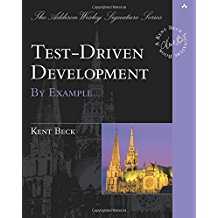 [Test-Driven Development by Example](https://www.amazon.com/Test-Driven-Development-Kent-Beck/dp/0321146530) :+1: _Java_ |  [The Art of Unit Testing](https://www.amazon.com/Art-Unit-Testing-examples/dp/1617290890/) :+1: _C#_ | 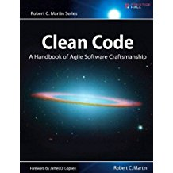 [Clean Code: A Handbook of Agile Software Craftsmanship](https://www.amazon.com/Clean-Code-Handbook-Software-Craftsmanship/dp/0132350882) :+1: |
| 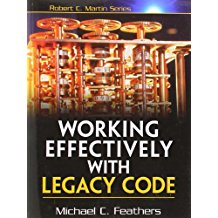 [Working Effectively with Legacy Code](https://www.amazon.com/Working-Effectively-Legacy-Michael-Feathers/dp/0131177052/) :+1: _Java, C++, C#_ | 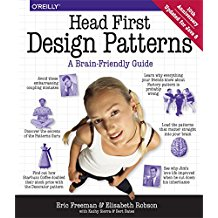 [Head First Design Patterns: A Brain-Friendly Guide](https://www.amazon.com/Head-First-Design-Patterns-Brain-Friendly/dp/0596007124) :+1: _Java_ | 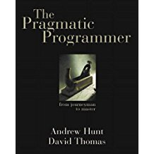 [The Pragmatic Programmer: From Journeyman to Master](https://www.amazon.com/Pragmatic-Programmer-Journeyman-Master/dp/020161622X/) :+1: |
|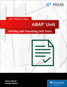 [ABAP Unit: Writing and Executing Unit Tests](https://www.sap-press.com/abap-unit-writing-and-executing-unit-tests_4298/) :+1: _ABAP_ | 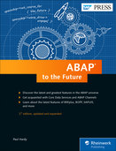 [ABAP to the Future](https://www.sap-press.com/abap-to-the-future_4161/) :+1: _ABAP_ | 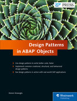 [Design Patterns in ABAP Objects](https://www.sap-press.com/design-patterns-in-abap-objects_4277/) :+1: _ABAP_ |
|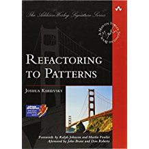 [Refactoring to Patterns](https://www.amazon.com/Refactoring-Patterns-Joshua-Kerievsky/dp/0321213351) | 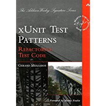 [xUnit Test Patterns: Refactoring Test Code](https://www.amazon.com/xUnit-Test-Patterns-Refactoring-Code/dp/0131495054/) |  [Dependency Injection in .NET](https://www.amazon.com/Dependency-Injection-NET-Mark-Seemann/dp/1935182501/) |
|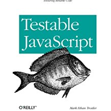 [Testable JavaScript: Ensuring Reliable Code](https://www.amazon.com/Testable-JavaScript-Ensuring-Reliable-Code/dp/1449323391) |  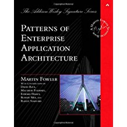 [Patterns of Enterprise Application Architecture](https://www.amazon.com/Patterns-Enterprise-Application-Architecture-Martin/dp/0321127420/) |  |

See more books at [Suggested Reading for Professional Scrum Developer](https://www.scrum.org/resources/suggested-reading-professional-scrum-developer)
