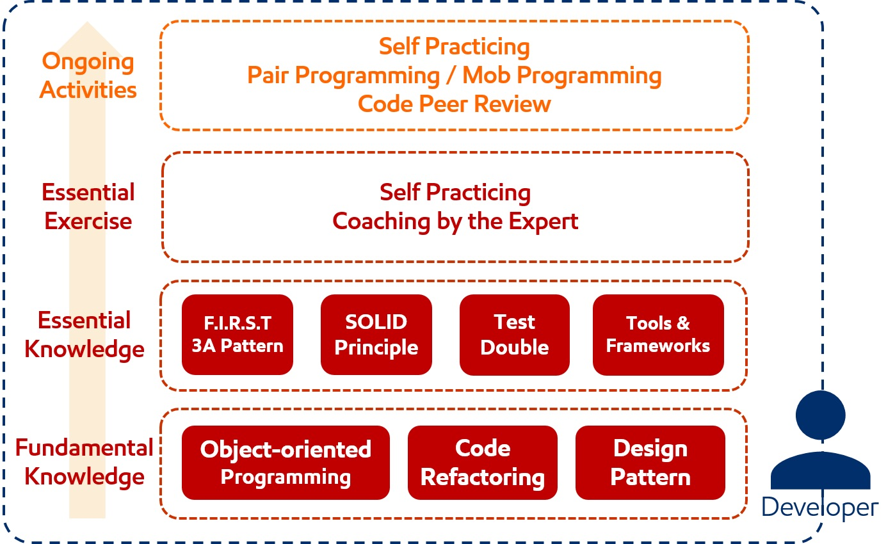

# Fundamental Knowledge

## Object-Oriented Programming

- Encapsulation
- Composition, inheritance, and delegation
- Polymorphism
- Objects and classes
- Open recursion

_Source: [Wikipedia](https://en.wikipedia.org/wiki/Object-oriented_programming)_

## Code Refactoring

- Target
  - Production Code
  - Test Code
  - Between Production and Test Code
- Techniques
  - More [Abstraction](https://en.m.wikipedia.org/wiki/Abstraction_(software_engineering))
    - [Field Encapsulation](https://en.m.wikipedia.org/wiki/Field_encapsulation)
    - [Type Generialization](https://en.m.wikipedia.org/wiki/Type_generalization)
    - Replace Conditional with [Polymorphism](https://en.m.wikipedia.org/wiki/Polymorphism_(computer_science))
  - Breaking Code Apart
    - [Extract Class](https://en.m.wikipedia.org/wiki/Extract_Class)
    - Extract Method
  - Improving Names and Location
    - Move Methos or Move Field
    - [Rename Method](https://en.m.wikipedia.org/wiki/Rename_Method) or Rename Field
    - [Pull Up](https://en.m.wikipedia.org/wiki/Pull_Up_refactoring), move to a [superclass](https://en.m.wikipedia.org/wiki/Superclass_(computer_science))
    - [Push Down](https://en.m.wikipedia.org/wiki/Push_Down), move to a [subclass](https://en.m.wikipedia.org/wiki/Subclass_(computer_science))

_Source: [Wikipedia](https://en.wikipedia.org/wiki/Code_refactoring)_

## Design Pattern

Here are most frequenly-used patterns as specified by Kerem Koseoglu in his book [ABAP to the Future](https://www.sap-press.com/abap-to-the-future_4161/).

- [Architectural Patterns](https://en.wikipedia.org/wiki/Architectural_pattern)
  - [MVC](https://en.wikipedia.org/wiki/Model%E2%80%93View%E2%80%93Controller), used all the time
- [Creational Patterns](https://en.wikipedia.org/wiki/Creational_pattern)
  - [Factory](https://en.wikipedia.org/wiki/Factory_method_pattern) and [builder](https://en.wikipedia.org/wiki/Builder_pattern) to create new objects in a centralized point
  - [Singleton](https://en.wikipedia.org/wiki/Singleton_pattern) and [multiton](https://en.wikipedia.org/wiki/Multiton_pattern) to prevent creation of multiple instances of the same objectrespectively
  - [Lazy initialization](https://en.wikipedia.org/wiki/Lazy_initialization) for overall performance improvement
- [Structural](https://en.wikipedia.org/wiki/Structural_pattern)
  - [Facade](https://en.wikipedia.org/wiki/Facade_pattern) to make the life of other developers easier
  - [Decorator](https://en.wikipedia.org/wiki/Decorator_pattern) to modify an object or dataset by multiple classes
- [Behavioral](https://en.wikipedia.org/wiki/Behavioral_pattern)
  - [Template method](https://en.wikipedia.org/wiki/Template_method_pattern) to prevent algorithm duplication among similar classes
  - [Strategy](https://en.wikipedia.org/wiki/Strategy_pattern) to make algorithms interchangeable
  - [Observer](https://en.wikipedia.org/wiki/Observer_pattern) to make objects communicate without making them interdependent
  - [Visitor](https://en.wikipedia.org/wiki/Visitor_pattern) to extend the functionality of classes without modifying legacy code

# Essential Knowledge

## Writing Unit Test

- [F.I.R.S.T Principles](https://en.m.wikipedia.org/wiki/Concurrency_pattern)
  - Fast
  - Independent
  - Repeatable
  - Self-Validating
  - Thorough and Timely
- [Testing Frameworks](https://en.wikipedia.org/wiki/List_of_unit_testing_frameworks)
- [3A's Pattern](http://xp123.com/articles/3a-arrange-act-assert/)
  - Arrange
  - Act
  - Assert
  
## Design Principles

- [KISS](https://en.m.wikipedia.org/wiki/KISS_principle): Keep it simple, stupid
- [DRY](https://en.m.wikipedia.org/wiki/Don't_repeat_yourself): Don't repeat yourself
- [YAGNI](https://en.wikipedia.org/wiki/You_aren't_gonna_need_it): You aren't gonna need it
- [SOLID](https://en.wikipedia.org/wiki/SOLID_(object-oriented_design)) ([Motivational Posters](https://blogs.msdn.microsoft.com/cdndevs/2009/07/15/the-solid-principles-explained-with-motivational-posters/))
  - [Single Responsibility Principle (SRP)](https://en.m.wikipedia.org/wiki/Single_responsibility_principle)
  - [Open Closed Principle (OCP)](https://en.m.wikipedia.org/wiki/Open/closed_principle)
  - [Liskov Substitution Principle (LSP)](https://en.m.wikipedia.org/wiki/Liskov_substitution_principle)
  - [Interface Segregation Principle (ISP)](https://en.m.wikipedia.org/wiki/Interface_segregation_principle)
  - [Dependency Inversion Principle (DIP)](https://en.m.wikipedia.org/wiki/Dependency_inversion_principle)
    - [Inversion of Control (IoC)](https://en.wikipedia.org/wiki/Inversion_of_control)
      - [Dependency Injection (DI)](https://en.m.wikipedia.org/wiki/Dependency_injection)
        - Constructor injection
        - Parameter injection
        - Setter injection
        - Interface injection
  
## Test Double

- Types
  - Dummy
  - [Stub](https://en.m.wikipedia.org/wiki/Test_stubs)
  - [Mock](https://en.m.wikipedia.org/wiki/Mock_object)
  - Spy
  - [Fake](https://en.m.wikipedia.org/wiki/Fake_object)
- Frameworks
  - SAP ABAP
    - [ABAP Test Double Framework (ATDF)](https://blogs.sap.com/?p=361154)
    - [ABAP CDS Test Double Framework](https://blogs.sap.com/2016/10/19/introduction-cds-test-double-framework-write-unit-tests-abap-cds-entities/)
  - Java
    - [Stubby4j](https://github.com/azagniotov/stubby4j)
    - [dbUnit](http://dbunit.sourceforge.net/)
    - [WireMock](http://wiremock.org/)